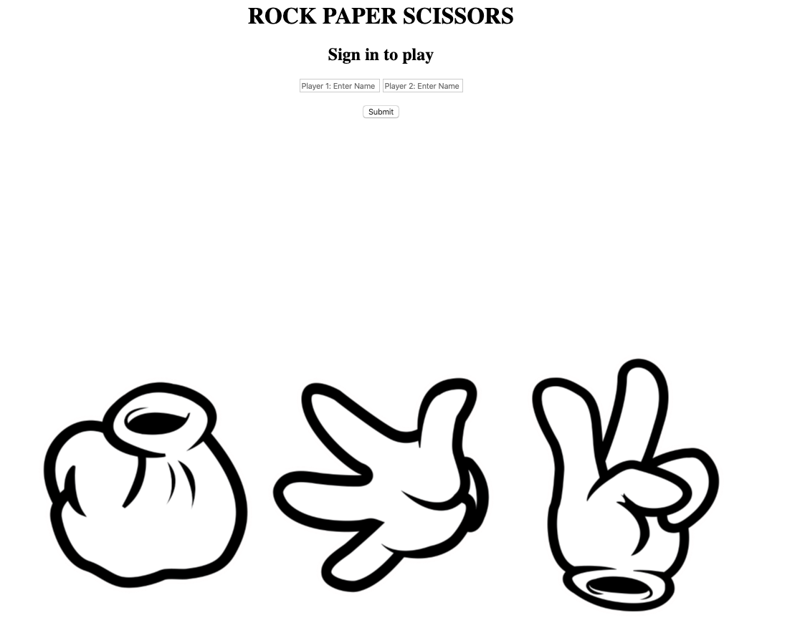

# Project Title
## Rock, Paper, Scissors, Lizard, Spock

# User Stories

As a marketeer
So that I can see my name in lights
I would like to register my name before playing an online game

As a marketeer
So that I can enjoy myself away from the daily grind
I would like to be able to play rock/paper/scissors

### And some Advanced 'extension' User Stories:

Use the special rules ( http://en.wikipedia.org/wiki/Rock-paper-scissors-lizard-Spock )

## Motivation

Build a simple game that allows a user to play rock, paper, scissors, lizard, spock against the machine.

## Build status
* 2x Feaure tests created and passed 
* Unit tests created and passed
* Live serveer tests passed
* Complete

* I attempted to use .travis.yml and tried to fix the error (The command "bundle install --jobs=3 --retry=3 --deployment" failed and exited with 16 during .)
* I found 4 references online that indicated that this was an issue and I should update my bundle version, which I did. However, this did not resolve the issue.
* I have deleted the file so I can complete the pull request.

## Code style
* Test-driven development

## Tech/framework used
* VS Code
* GitHub
* Bundler

## Built with
* Ruby
* Embedded Ruby
* Rspec
* Sinatra
* Capybara

## Installation
* Clone the repo
* Run bundle

## Tests
* Feature tests using Capybara
* Rspec tests on all the necessary methods
* Web browser tests
* I have run rspec and all the tests pass with a 95.73% coverage.

## Screenshots

## How to use?
* Run rackup in the terminal
* Open the brower and enter localhost:9292
* Enter your name and click submit
* Make a selection from the 5 choices
* The machine will randomly choose it's own
* Both choices will be displayed
* An outcome will also be displayed
* Click restart to change users

## Credits
* JP Ferreira