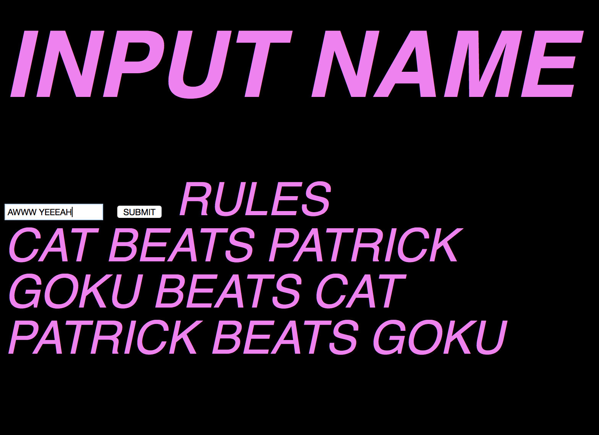
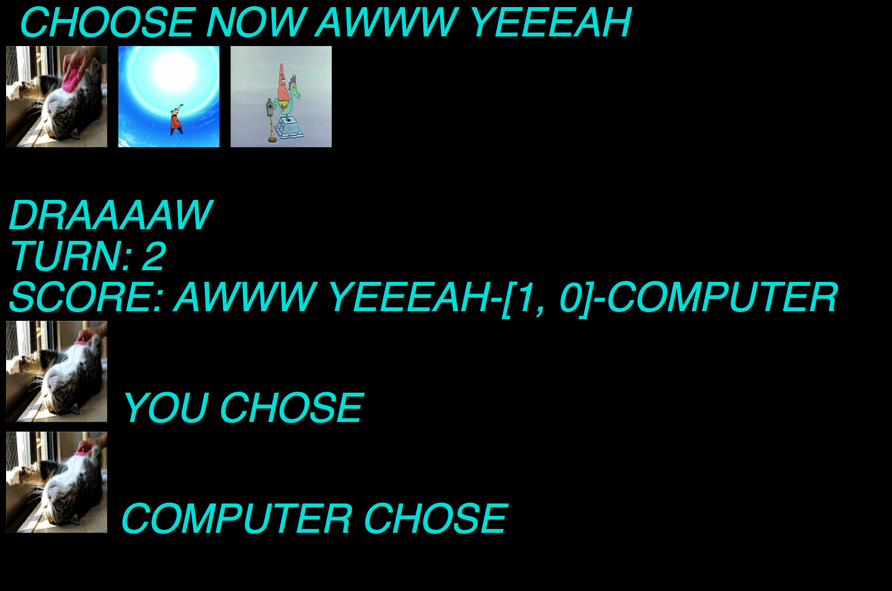

readme todo
*include technology
*possible implementations
*gems
*intro*


CAT GOKU PATRICK CHALLENGE

## Intro
A take on the classic rock - paper - scissors

## Upcoming features
3d ultracolour graphics
prize money
*donut* giveaways
multiplayer

## Revised Rules

- CAT BEATS PATRICK
-  GOKU BEATS CAT
-  PATRICK BEATS GOKU

Instructions
-------
1. visit https://nameless-inlet-7662.herokuapp.com/
2. enter name
3. select a picture

Screenshots
-------
step 1


step 2


step 3


##Technology involved
-----
ruby
sinatra
capybara
rspec
heroku

##Gems used
---
rspec
rubocop-rspec
rubocop
coveralls
capybara
byebug
rspec-sinatra


Task
----

Knowing how to build web applications is getting us almost there as web developers!

The Makers Academy Marketing Array ( **MAMA** ) have asked us to provide a game for them. Their daily grind is pretty tough and they need time to steam a little.

Your task is to provide a Cat, Goku, Patrick game for them so they can play on the web with the following user stories:

```sh
As a marketeer
So that I can see my name in lights
I would like to register my name before playing an online game

As a marketeer
So that I can enjoy myself away from the daily grind
I would like to be able to play rock/paper/scissors
```
