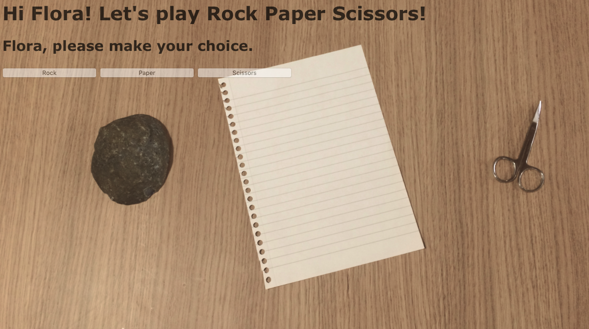
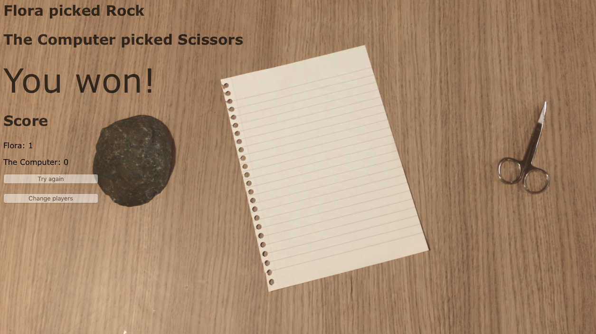

Task
----

The Makers Academy Marketing Array ( **MAMA** ) have asked us to provide a game for them. Their daily grind is pretty tough and they need time to steam a little.

Your task is to provide a _Rock, Paper, Scissors_ game for them so they can play on the web with the following user stories:

```sh
As a marketeer
So that I can see my name in lights
I would like to register my name before playing an online game

As a marketeer
So that I can enjoy myself away from the daily grind
I would like to be able to play rock/paper/scissors
```

My Approach
----

- I began by making a single player game, where the user plays the computer. I decided that the model should take three classes: Player, which saves the players name and keeps track of score, Computer, which generates a random option, and Game, which contains the logic for selecting options and deciding the result.
- A new game instance is initialized with player_1 and player_2, and a computer can be passed in as player_2.
- The player can first enter their name, then they are redirected to the next page where they can select their weapon of choice.
- The computer then generates a random choice, and the game compares the two to decide the winner.
- When I added the two player option, the game class did not need to change, as it was able to receive a second player rather than a computer.




Issues I encountered
----

- Where to place if/else statements when there were several possible messages to be displayed (e.g. declaring the winner). I decided to keep these in the view to keep presentation logic out of the model.
- Stubbing out the randomness in the feature tests. After realising the usual rspec 'allow...to receive' doesn't work because we are not testing instances, I discovered 'allow_any_instance_of...' would solve this problem.
- When there are different paths the game can take (e.g. after the user selects single or multiplayer), should those paths all go in the controller? I ended up defining duplicate routes depending on the player's selection, e.g. '/single-player' and '/multiplayer'.
