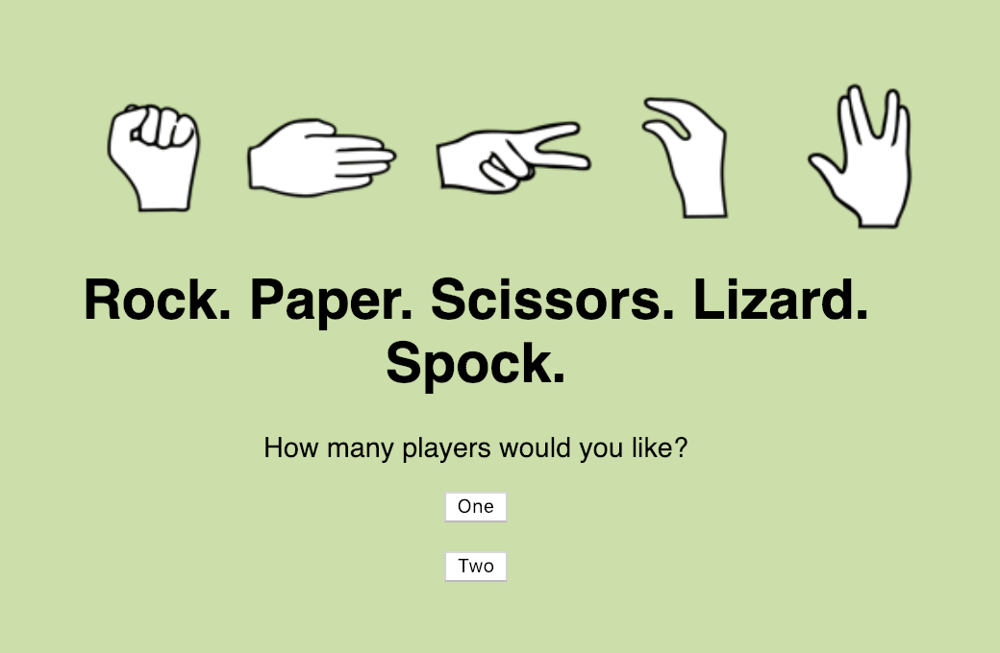
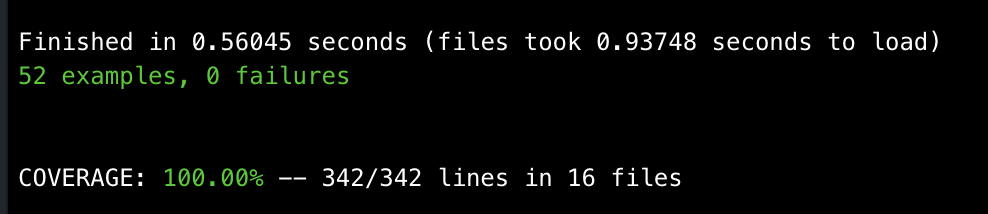

# Rock, Paper, Scissors
This is a game that let's you play a game of rock paper scissors lizard spock, you can play single player against the computer or multiplayer. The app is written in Ruby using Sinatra as the framework.

### How do I Use it?
1. Clone this repo `https://github.com/Caitlin-cooling/rps-challenge.git`
2. Run `bundle` to install all gems
2. Run the ruby file `app.rb`, this will start your server. Then in your browser go to `localhost:4567`, where you will see the index page of the app

This game is suitable for either one or two players:

#### Single Player
You will be asked for your name, and you will be playing against the computer. You will be able to pick the move that you would like to make; rock, paper or scissors.

You will then be redirected to a page that confirms both your and the computers moves, and let's you know you who won. Click try again to restart the game.

#### Two Players
You will be asked for the names of the two players. Once these has been entered you will be told who's turn it is and they will get to choose the move that they would like to make; rock, paper or scissors. Then it will be the next persons turn to do the same.

You will then be redirected to a page that confirms both moves and let's you know you who won. Click try again to restart the game.

### Running the tests
The tests for this program use rspec and capybara, so simply run `rspec` from within this directory. Simplecov is used to check test coverage.

All tests are passing and test coverage is 100%.

### Linting
The code is linted with Rubocop, run `rubocop` from within the directory to see offences. Linter is currently passing.

### My Approach to Solving this Problem
I took an iterative approach when solving this problem. I first implemented single player with only choices of rock, paper and scissors. Then I implemented multiplayer. After this I implemented the extra moves; lizard and spock and brought single player and multiplayer in a single app.

I TDD'd the app using OOP principles. For example I refactored to ensure separation of concerns for example using the `messages` module to handle display messages.

### Structure
The model (classes and modules) is held in the `lib` folder. Views for the pages are held in the `views` folder. `App.rb` is the controller for the app. All tests are in the `spec` folder, these are split into `features` and `units` folders. The `public` folder contains style sheets and images.

### Known Issues
* I am aware that setting the moves conditionally in the post /results route could perhaps be done more effectively
