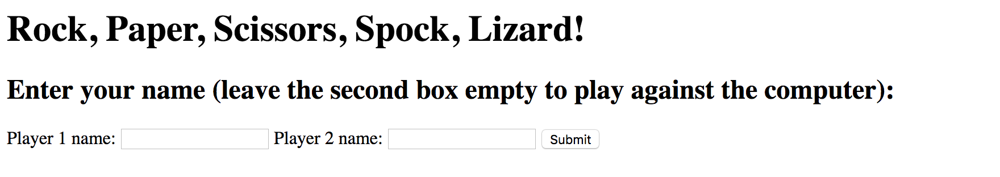
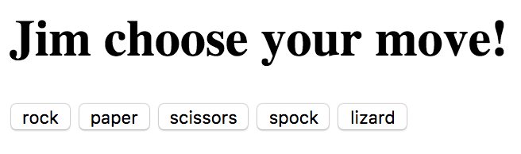
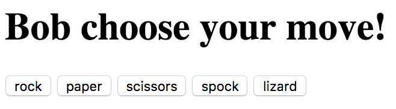
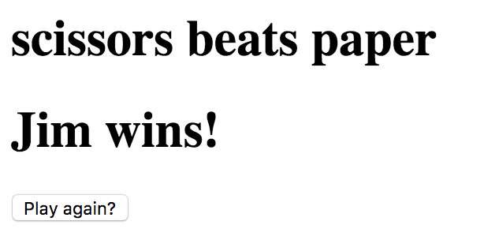

# RPS Challenge

How to run
--------------

1. `git clone`
2. `gem install bundle` (if you don't have bundle already)
3. `bundle`
4. `rackup`
5. In your browser go to localhost:9292

How to play
----------






My approach
----------

I began by modelling how I wanted my site to work and diagramming what I needed to do. I decided I would need 3 separate classes in order to adhere to the single responsibility principle. I choose to have a classes for the Player and Computer which would store values unique to them (their names and their choice of move) and a Game class which would handle all game logic.

As usual I went through the challenge using TDD and BDD methodologies, first creating, failing and passing unit tests, then feature tests and finally testing the live site itself.

I avoided the need to use a global variable by implementing a class method on Game using a class instance variable to store a game instance.

Overall I am happy with my app in its current form, but would like to pretty it up a bit.

Task
----

Knowing how to build web applications is getting us almost there as web developers!

The Makers Academy Marketing Array ( **MAMA** ) have asked us to provide a game for them. Their daily grind is pretty tough and they need time to steam a little.

Your task is to provide a _Rock, Paper, Scissors_ game for them so they can play on the web with the following user stories:

```sh
As a marketeer
So that I can see my name in lights
I would like to register my name before playing an online game

As a marketeer
So that I can enjoy myself away from the daily grind
I would like to be able to play rock/paper/scissors
```

Hints on functionality

- the marketeer should be able to enter their name before the game
- the marketeer will be presented the choices (rock, paper and scissors)
- the marketeer can choose one option
- the game will choose a random option
- a winner will be declared


As usual please start by

* Forking this repo
* TEST driving development of your app


## Bonus level 1: Multiplayer

Change the game so that two marketeers can play against each other ( _yes there are two of them_ ).

## Bonus level 2: Rock, Paper, Scissors, Spock, Lizard

Use the _special_ rules ( _you can find them here http://en.wikipedia.org/wiki/Rock-paper-scissors-lizard-Spock_ )

## Basic Rules

- Rock beats Scissors
- Scissors beats Paper
- Paper beats Rock

In code review we'll be hoping to see:

* All tests passing
* High [Test coverage](https://github.com/makersacademy/course/blob/master/pills/test_coverage.md) (>95% is good)
* The code is elegant: every class has a clear responsibility, methods are short etc.

Reviewers will potentially be using this [code review rubric](docs/review.md).  Referring to this rubric in advance may make the challenge somewhat easier.  You should be the judge of how much challenge you want this weekend.

Notes on test coverage
----------------------

Please ensure you have the following **AT THE TOP** of your spec_helper.rb in order to have test coverage stats generated
on your pull request:

```ruby
require 'simplecov'
require 'simplecov-console'

SimpleCov.formatter = SimpleCov::Formatter::MultiFormatter.new([
  SimpleCov::Formatter::Console,
  # Want a nice code coverage website? Uncomment this next line!
  # SimpleCov::Formatter::HTMLFormatter
])
SimpleCov.start
```

You can see your test coverage when you run your tests. If you want this in a graphical form, uncomment the `HTMLFormatter` line and see what happens!
