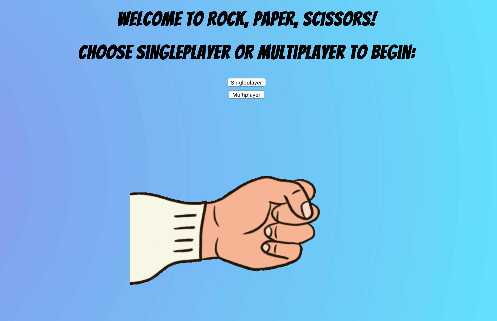

# Rock, Paper Scissors

Deployed here: https://rps-hibo.herokuapp.com



## Description

Functionality

- A user can enter their name before the game.
- A user can select single or multi player mode.
- A user enters their choice (Rock, Paper or Scissors).
- In single player mode, the game will choose a random option for the computer.
- A winner will be declared.

## How to use

If you would like to use this app locally, please clone this repository and type the following commands into your terminal:

```
run 'bundle'
run 'ruby app.rb'
```

Then open a browser of your choice and type in 'localhost:' followed by the port number that the app has been served in. For example, 'localhost:9292'. You can find the port number in the terminal output after running the command `ruby app.rb`.

## What else I would like to add

I would like to improve upon this challenge and add the following:

- Account for the edge case of a user typing incorrect input. I could do this by adding error messages/alerts or by changing the input from text input to choice input from a drop down.


## Challenge
Below is the challenge as described by Makers.
----------------------

Knowing how to build web applications is getting us almost there as web developers!

The Makers Academy Marketing Array ( **MAMA** ) have asked us to provide a game for them. Their daily grind is pretty tough and they need time to steam a little.

Your task is to provide a _Rock, Paper, Scissors_ game for them so they can play on the web with the following user stories:

```
As a marketeer
So that I can see my name in lights
I would like to register my name before playing an online game

As a marketeer
So that I can enjoy myself away from the daily grind
I would like to be able to play rock/paper/scissors
```
