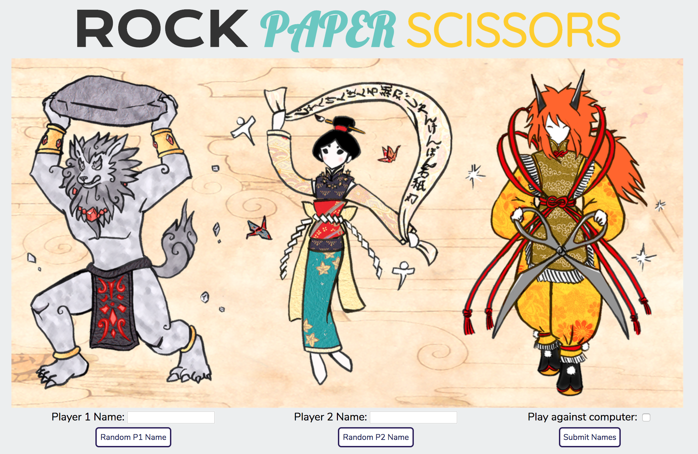
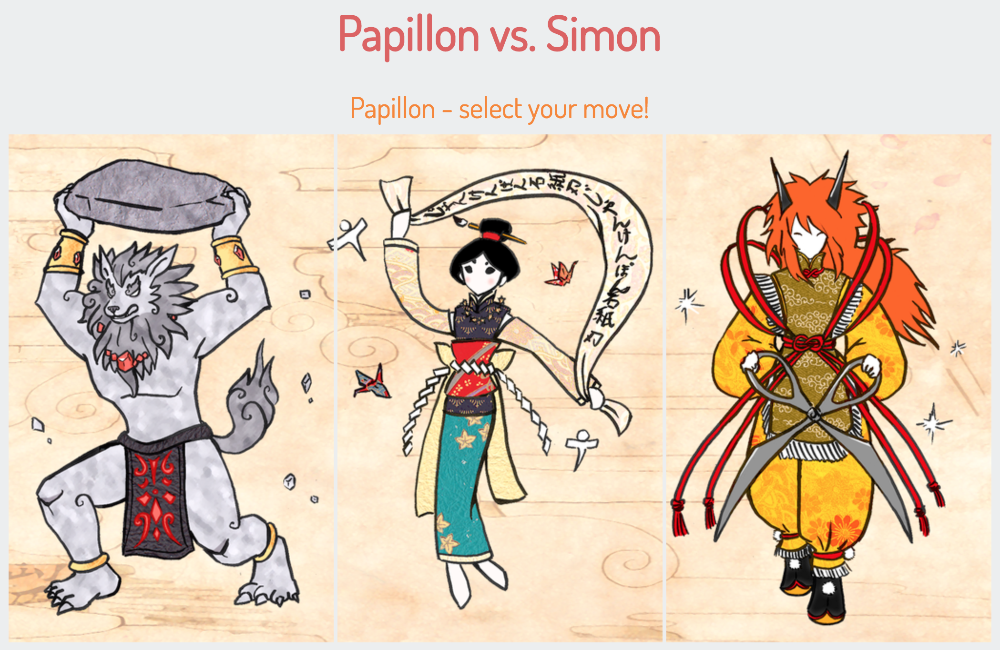
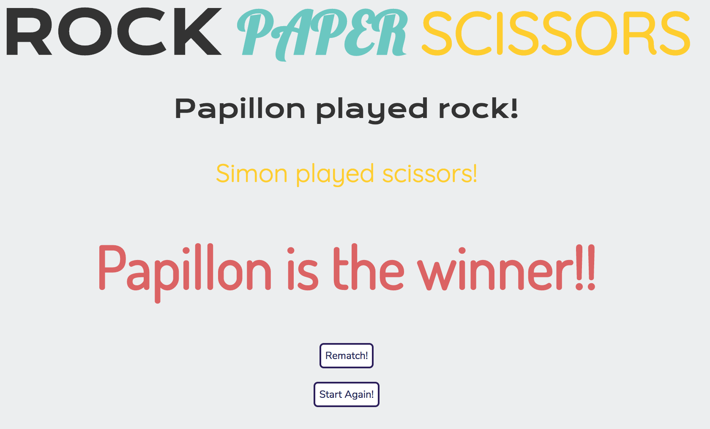

# Rock Paper Scissors

## Introduction
Play Rock-Paper-Scissors against the computer or a second (human) player.

This app was made using Ruby for the server-side (with Sinatra for the web framework) and HTML (erb) and CSS for the client-side. A TDD-approach was taken using the RSpec and Capybara test frameworks.

## Screenshots
**Home Screen** 
  
**P1 Move Select** 
  
**P2 Move Select** 
  
**Result Screen** 

## Features
* Player name entry - manual input or random name generator
* Play against the computer or a human
* Graphical interface to select your move
* Automatic logic to determine and show the winner

## Installation
1. Clone this repo: `$ git clone git@github.com:julesnuggy/rps-challenge.git`
2. Install dependencies: `$ bundle install`
3. Boot local server: `$ shotgun` or `$ ruby rps_app.rb`
4. Open localhost in browser (e.g. http://localhost:9393) - check your Terminal for port number after you've booted the server

## Testing
RSpec was used for unit testing of the calc_result logic, whilst Capybara was used to feature test the actual game via browser interaction simulation. To run these tests, simply run `$ rspec` in your Terminal.
