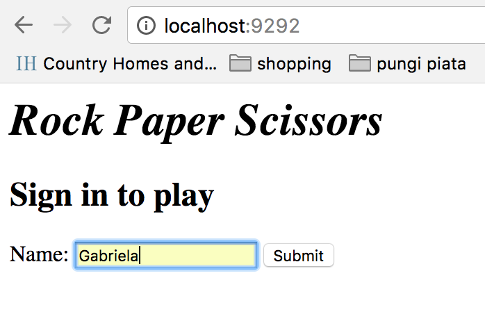
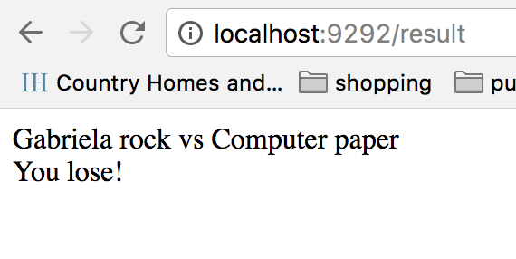

# RPS Challenge

Downloading the app:

- $ git clone https://github.com/gabrielabud/rps-challenge.git
- $ cd rps-challenge
- $ bundle
- $ rackup

APP simulation





Task

The Makers Academy Marketing Array ( **MAMA** ) have asked us to provide a game for them. Their daily grind is pretty tough and they need time to steam a little.

Your task is to provide a _Rock, Paper, Scissors_ game for them so they can play on the web with the following user stories:

```sh
As a marketeer
So that I can see my name in lights
I would like to register my name before playing an online game

As a marketeer
So that I can enjoy myself away from the daily grind
I would like to be able to play rock/paper/scissors
```

Hints on functionality

- the marketeer should be able to enter their name before the game
- the marketeer will be presented the choices (rock, paper and scissors)
- the marketeer can choose one option
- the game will choose a random option
- a winner will be declared

## Basic Rules

- Rock beats Scissors
- Scissors beats Paper
- Paper beats Rock
