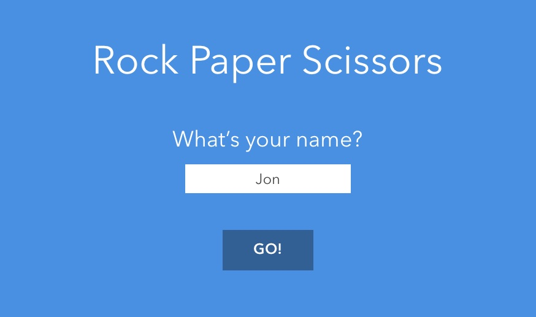
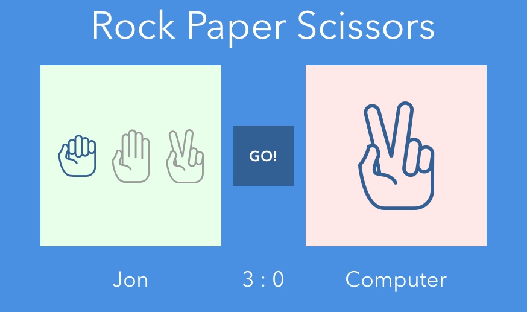
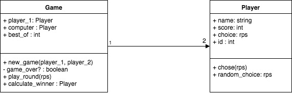

# RPS Challenge

## Overview

This web app allows a user to play rock paper scissors against the computer.

## Set up

- `git clone git@github.com:jonurry/rps-challenge.git`
- `cd rps-challenge`
- `bundle`
- `rackup`

## Approach

You can see evidence of this by looking at my commit history and that order in which I did things.

I began by sketching out what I wanted the app to look like.

There are two main screens. The home screen where the user enters their name:

and the main screen where the game is played:

Then I created a class diagram to get an idea of the classes that I would need as well as their behaviour (methods) and state (attributes).

Finally, I thought about the routes that I would need:

## Routes

### `/` (`:get`)

Main index page. Asks the player for their name. Posts to `name`

### `/name` (`:post`)

Processes player 1's name and redirects to `play`

### `/play` (`:get`)

Handles selection of rock, paper or scissors and submits choice. Posts choice to `choice`

### `/choice` (`:post`)

Processes player 1's choice and redirects to `round` if the game is not over, or redirects to `win-lose` if the game is over.

### `/round` (`:get`)

Shows the outcome of the round. Whether player 1 or the computer won and what their choices were. Updates the winning player's score. AIncludes a link to play the next round that redirects to `play`

### `/win-lose` (`:get`)

Shows the overall winner. Includes a link to start a new game. This will reset the scores and redirect to `play`

## Process

Initially I thought about the design and produced UI sketches, a UML class diagram and thought about the app routes.

I made the initial set up to get a minimal web app up and running with sinatra, rspec and capybara.

When building out the app, I first wrote feature or unit tests and then made those tests pass by implementing code in the model, views or controller.

The first functionality that I tackled was entering the user's name in a form. The name was then posted to the `/name` route where the name was stored (initially in a session variable).

Then I wrote tests and code for allowing the use to select and submit either rock, paper or scissors.

I then replaced the session storage with actual classes for the `Game` and `Player`s. These classes were written test first. The `Game` was implemented as a singleton.

I then tested and coded the random choice of rock, paper or scissors by the computer.

Next up was determining who had won each round based on the player and computer selections. This was tested at the unit and feature level.

Selections were reset between rounds.

I made appropriate use of doubles, dependency injection, singleton, MVC, single responsibility principle and re-factoring throughout.

Test coverage is at 100% over 57 tests.

Rubocop only had 2 issues that I couldn't resolve:

- lib/game.rb:40:3: C: Metrics/AbcSize: Assignment Branch Condition size for player_loses? is too high. [15.13/15] def player_loses?

- lib/game.rb:46:3: C: Metrics/AbcSize: Assignment Branch Condition size for player_wins? is too high. [15.13/15] def player_wins?

## Future Work

If I had more time I would:

- Tidy up the presentation with some more CSS
- Add scoring (best of 3 or best of 10)
- Add the extra rules for spock and lizard
- Make it multi-player
- Separate out printing messages from the classes to ensure single responsibility of classes
