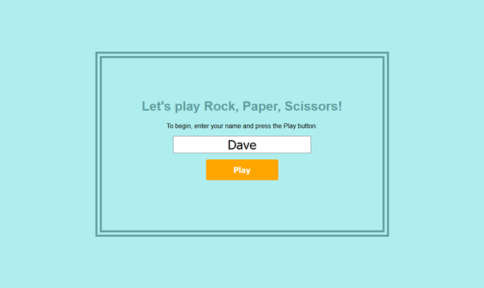
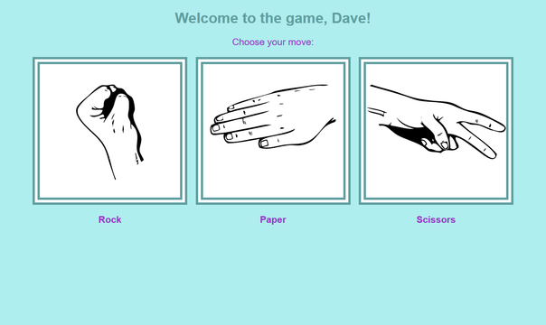
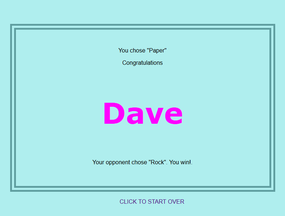
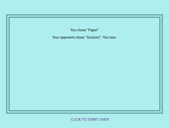
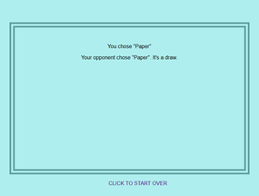

[](https://travis-ci.org/dafuloth/rps-challenge) [](https://coveralls.io/github/dafuloth/rps-challenge?branch=master)

# RPS Challenge

([Link to original README.md](/original-README.md))

This is a web app offering a game of Rock, Paper, Scissors. Written in Ruby using the Sinatra framework, with ERB for templating.

TDD/BDD with RSpec, using Capybara for BDD feature tests, and SimpleCov test coverage tool.

<p align = "center">
  <br>
  <em>Starting a new game</em>
</p>

<br>

<p align = "center">
  <br>
  <em>Making a move</em>
</p>

<br>

<p align = "center">
  
  
  
  <br>
  <em>Result: Win, Lose, or Draw</em>
</p>

---


<details><summary><i>click for table of contents</i></summary>
<br>

[Getting started](#getting-started)

[Features](#features)

- [(1) Player registers their name before playing an online game](#player-registers-their-name-before-playing-an-online-game)

- [(2) Player can play *rock, paper, scissors*](#player-can-play-rock-paper-scissors)

[Issues encountered](#issues-encountered)

- [Web app only renders correctly in Safari](#web-app-only-renders-correctly-in-safari): 
[`”` vs. `"`](#-vs-)

- [It's not a bug, it's a feature!](#unintentional-feature-aka-its-not-a-bug-its-a-feature)

[Useful Links](#links)

</details>

## Getting started

Either visit the live [Heroku-hosted version](https://quiet-wildwood-32600.herokuapp.com/), or `clone` and launch this web app locally:

```sh
git clone git@github.com:dafuloth/rps-challenge.git

bundle

ruby app.rb

```

After `bundle`, run tests with `rspec` or `rake spec`.

## Features

### Player registers their name before playing an online game

```sh
As a marketeer
So that I can see my name in lights
I would like to register my name before playing an online game

```

The feature test:

```ruby

feature 'Registering names' do
  scenario 'Player name displayed before playing an online game' do
    visit('/')
    fill_in :player_name, with: 'Winston'
    click_button 'Play'
    expect(page).to have_content 'Winston'
  end
end

```

### Player can play *rock, paper, scissors*

```sh

As a marketeer
So that I can enjoy myself away from the daily grind
I would like to be able to play rock/paper/scissors

```
At this point it became clear that it would be a good idea to extract to a test helper the sign-in and clicking Play:

```ruby

def sign_in_and_play
  visit('/')
  fill_in :player_name, with: 'Winston'
  click_button 'Play'
end

```

These lines in `single_player_spec.rb` are replaced by calling the method `sign_in_and_play`. This method will be used in the gameplay feature tests for the outcomes of Win, Draw, and Loss.

```ruby

feature 'Playing the game' do
  scenario 'Player plays "Rock"' do
    sign_in_and_play
    click_on 'rock'
    expect(page).to have_content 'You chose "Rock"'
  end  

  scenario 'Player plays "Paper"' do
    sign_in_and_play
    click_on 'paper'
    expect(page).to have_content 'You chose "Paper"'
  end

  scenario 'Player plays "Scissors"' do
    sign_in_and_play
    click_on 'scissors'
    expect(page).to have_content 'You chose "Scissors"'
  end  

  scenario 'Player plays "Rock" and loses' do
    allow_any_instance_of(Array).to receive(:sample).and_return('paper')
    sign_in_and_play
    click_on 'rock'
    expect(page).to have_content 'Your opponent chose "Paper". You lose.'
  end

  scenario 'Player plays "Paper" and draws' do
    allow_any_instance_of(Array).to receive(:sample).and_return('paper')
    sign_in_and_play
    click_on 'paper'
    expect(page).to have_content 'Your opponent chose "Paper". It\'s a draw.'
  end

  scenario 'Player plays "Scissors" and wins' do
    allow_any_instance_of(Array).to receive(:sample).and_return('paper')
    sign_in_and_play
    click_on 'scissors'
    expect(page).to have_content 'Your opponent chose "Paper". You win!'
  end  
end


```


## Issues encountered

### Web app only renders correctly in Safari

_a.k.a. why it's often better to manually type a line of code instead of copying and pasting that line from the web_

#### `”` vs. `"`

Look closely at those two characters. I didn't see the difference at first but my browsers weren't so easily fooled.

In the end it was the [W3C Markup Validation Service](https://validator.w3.org) which allowed me to identify and resolve the issue.

I was writing [my CSS stylesheet](/public/css/styles.css) and could not remember how to link to it in my HTML. I looked up the line, copy & pasted the `type=”text/css”` part I was missing.

`<link rel="stylesheet" type=”text/css” href="/css/style.css" />`

It turns out that Safari is more forgiving because it rendered my HTML/CSS perfectly. Chrome and Firefox, not so much.

I even tried uploading my app to Heroku, in case there was something odd happening locally - but same thing. Arguably, it was Safari that rendered incorrectly: my incorrect code should not have resulted in a correct rendering. Firefox and Chrome did their jobs.

#### Unintentional feature: a.k.a. It's not a bug, it's a feature!
Because I used query strings instead of sessions for my data persistence, it's actually possible to play just by supplying the appropriate arguments:

https://quiet-wildwood-32600.herokuapp.com/result?player=Dave&choice=paper

If I wanted to change player name to _David_ and the choice to _rock_, I can just change it in the query string:

https://quiet-wildwood-32600.herokuapp.com/result?player=David&choice=rock

The obvious advantages of my approach is that it simpler and faster to use. Like, if you wanted to make a decision whether to do something, you could play a quick round of rock-paper-scissors with the computer - it'll return a different random result to every invocation.

## Links

- Some sites I looked at when I was centering an element: [CSS-Tricks](https://css-tricks.com/centering-css-complete-guide/), [Tipue](http://www.tipue.com/blog/center-a-div/)

- Rock, paper, scissors hand images modified from [this image](https://openclipart.org/detail/63805/rock-scissors-paper) from Openclipart contributor _mazeo_

- I used [Inkscape](https://inkscape.org/) to make the separate Rock/Paper/Scissors images from the original SVG file

- I'm developing a preference for [flexbox](https://css-tricks.com/snippets/css/a-guide-to-flexbox/)

## To Do

- Use sessions
- Either delete Player class or actually make use of it


## Addendum

- Added Travis CI so that I can add the badge showing that tests are passing
- Now working with a Ruby environment on Windows so Gemfile.lock that results from running `bundle` records platform as `x64-mingw32` which is incompatible with Travis CI. To fix this, I added the following to `.travis.yml`:

        before_install:
        - bundle lock --add-platform ruby
        - bundle lock --add-platform x86_64-linux

- Heroku set to auto-deploy after CI passing, so this push should trigger the deployment
