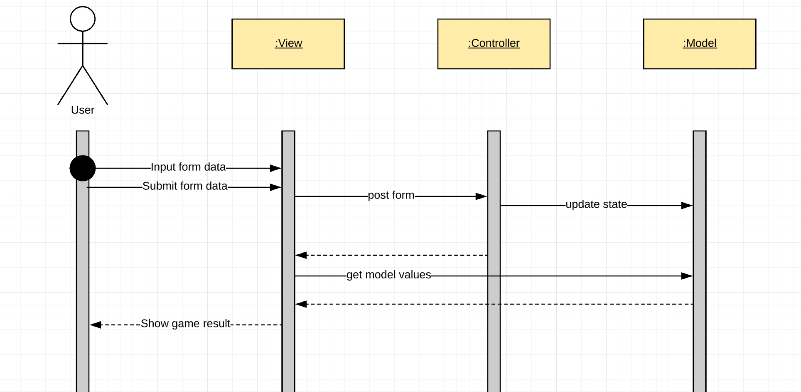

# RPS Challenge

Task
----

Your task is to provide a _Rock, Paper, Scissors_ game for them so they can play on the web with the following user stories:

```sh
As a marketeer
So that I can see my name in lights
I would like to register my name before playing an online game

As a marketeer
So that I can enjoy myself away from the daily grind
I would like to be able to play rock/paper/scissors
```

Functionalities

- the marketeer should be able to enter their name before the game
- the marketeer will be presented the choices (rock, paper and scissors)
- the marketeer can choose one option
- the game will choose a random option
- a winner will be declared

Cloning the project to your computer
----------------------
In the terminal: git clone https://github.com/luisatheodoro/rps-challenge.git
then `cd rps-challenge`

Installing dependencies type in the terminal `bundle install`

Running linting
----------------------
In the terminal write `rubocop`

Run tests
----------------------
on terminal type `rspec`

Test coverage
----------------------
COVERAGE: 100.00% -- 50/50 lines in 4 files

Start local server and get the url
----------------------
on terminal type `ruby app.rb`
pay attention to this on terminal `* Listening on tcp://localhost:4567` or `port=4567`
go to web browser and go to http://localhost:4567/ (this will be the url that the server provided)

Playing
----------------------
Write you name and choose your weapon from dropdown and hit PLAY.
The result page will display your choice, the computer choice, who won the round and the score.
To be able to play again, `click the browser back button` and choose another weapon and hit PLAY.

Code Design
----------------------
For this project I've followed a MVC(Model, View, Controller) architectural pattern
commonly used for user interface applications like a web app.
The interaction between the MVC in this app starts with the user opening the
web page, inputing the data and clicking button submit, this click even will be
listened by the View, when View listen to the event it will then send a POST form
to the Controller, the Controller will communicate with Model and update Model state.
The Model will get user input and process it according with the code logic, in this case
compute who's the winner of the game and store the new data. Controller will then
open View and Ruby will read it, Ruby will identify that the View needs values from the Model
View will send a GET request from Model and it will return it directly to the View. Once 
View has everything it needs, it will then show the HTML formatted page to the user
with game result.

The MVC has many interpretations I followed Mozilla view on it:
https://developer.mozilla.org/en-US/docs/Web/Apps/Fundamentals/Modern_web_app_architecture/MVC_architecture

user flow diagram
----------------------

