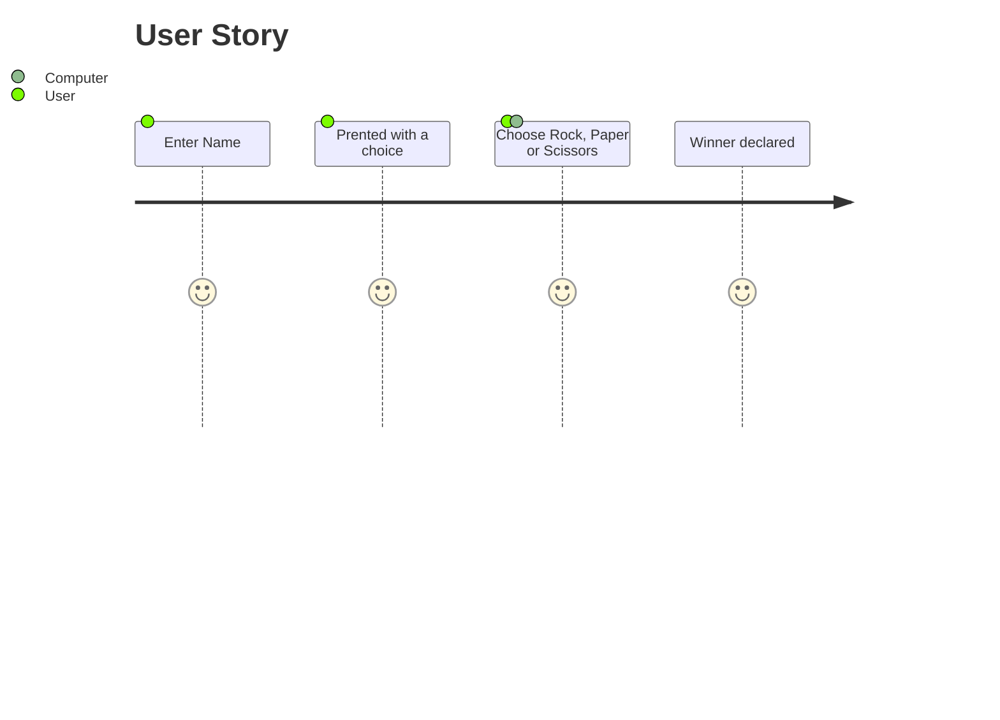
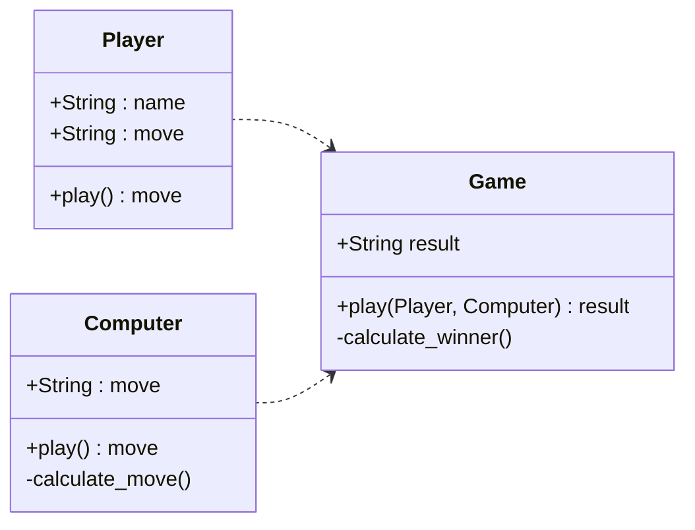

# RPS Challenge

This is a weekend challenge for the end of week 3 of the 12 week bootcamp I am doing with [Makers Academy](https://www.makers.tech/?utm_source=adwords&utm_medium=ppc&utm_campaign=B2C%20Hybrid&utm_term=makers%20academy&hsa_acc=7172166340&hsa_cam=13568953605&hsa_grp=123027501759&hsa_ad=528554003929&hsa_src=g&hsa_tgt=aud-1330588356932%3Akwd-315575993965&hsa_kw=makers%20academy&hsa_mt=e&hsa_net=adwords&hsa_ver=3&gclid=EAIaIQobChMI65HU3dXR9wIViK3tCh032gfLEAAYASAAEgL3xfD_BwE). This week we have been learning how to make simple web apps using Ruby and Sinatra. Testing is being handled with Rspec and Capybara. 


This weeks task is to make a _Rock, Paper, Scissors_ game for them so they can play on the web with the following user stories:

```
As a player
So that I can see my name in lights
I would like to register my name before playing an online game

As a player
So that I can enjoy myself away from the daily grind
I would like to be able to play rock/paper/scissors
```

Hints on functionality

- the marketeer should be able to enter their name before the game
- the marketeer will be presented the choices (rock, paper and scissors)
- the marketeer can choose one option
- the game will choose a random option
- a winner will be declared


## Basic Rules

- Rock beats Scissors
- Scissors beats Paper
- Paper beats Rock

## Instruction




## Class Diagram for model
<br>

