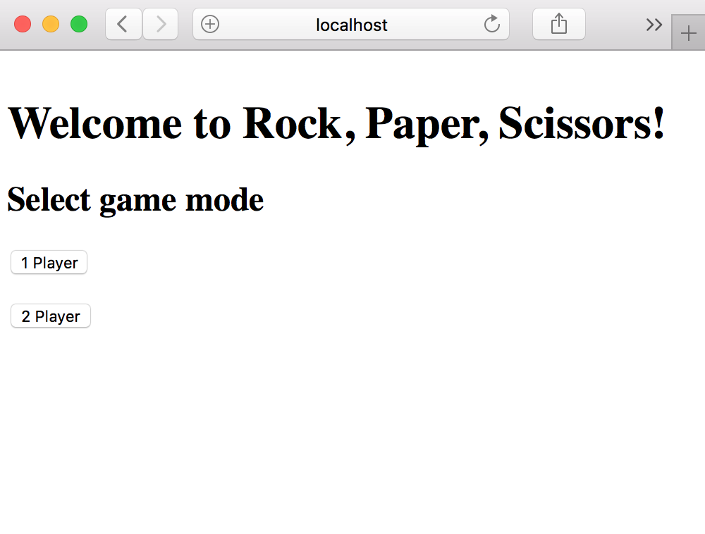
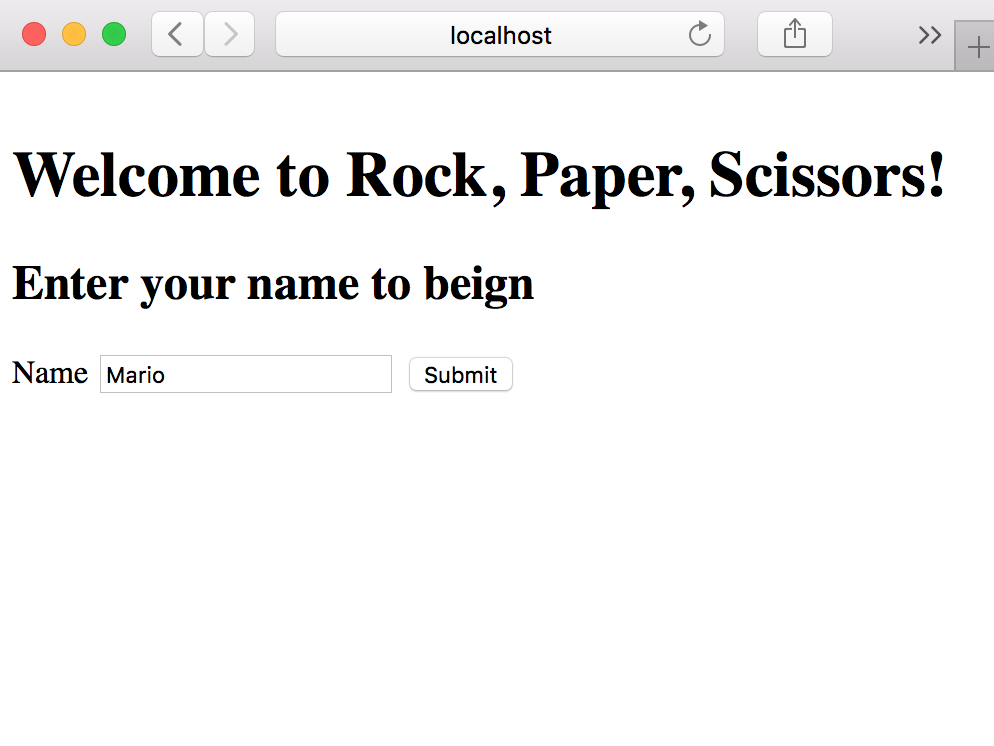
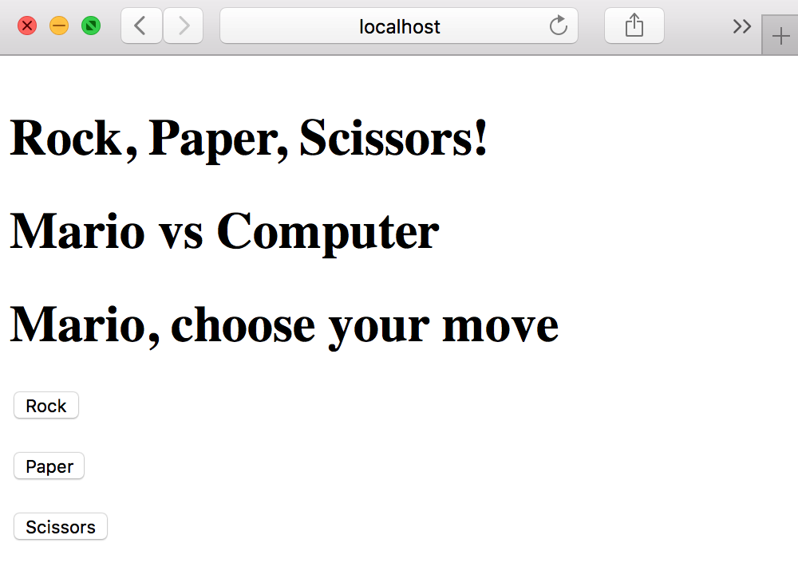
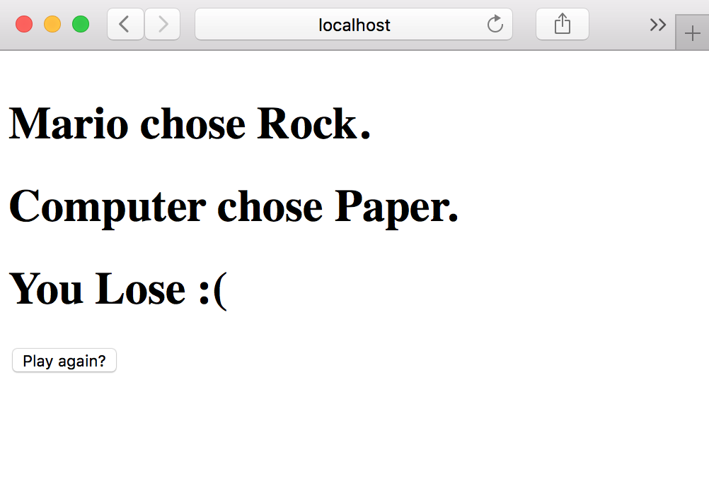
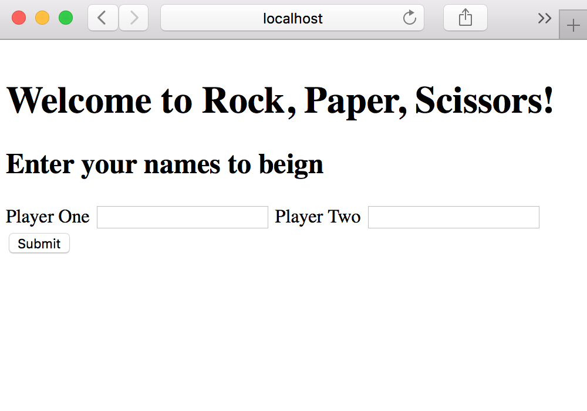
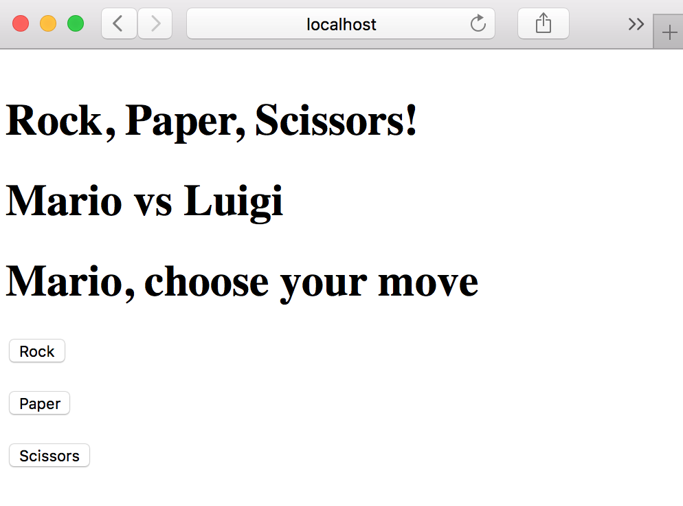
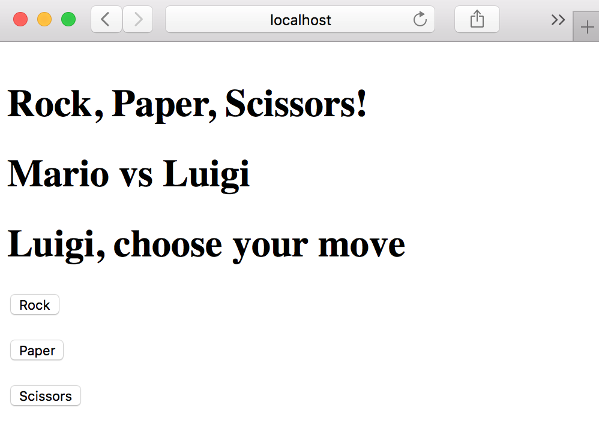
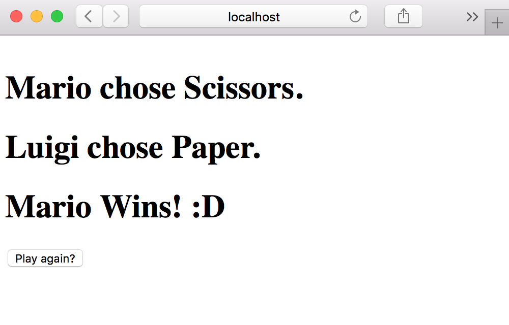

# RPS Challenge

## My Approach
I built the program following TDD practices. I took the user stories that were provided and listed the neccesary functionality. I then wrote a test for a functionality and results informed the code that I had written. This was repeated until I reached the functionality to meet the user stories. This same process was used to implement a multiplayer feature. The test were written with doubles, where required, in order to achieve isolation, and stubbed where needed to control randomness while testing.

The program follows an OOD. The program was separated into classes, each of which only fulfils a single responsibility, allowing any future changes or additional functionality to be added with minimal impact to the rest of the program.

## Installation
1. Clone this repo
2. `cd` into the directory
3. Run `bundle` to install the required gems
4. Run `rackup config.ru` to start the server
5. Visit `http://localhost:9292` in your web browser
6. Have fun!

## Example Usage
```
$ rackup config.ru
[2018-10-21 19:31:17] INFO  WEBrick 1.4.2
[2018-10-21 19:31:17] INFO  ruby 2.5.0 (2017-12-25) [x86_64-darwin16]
[2018-10-21 19:31:17] INFO  WEBrick::HTTPServer#start: pid=3440 port=9292
```


### One Player Mode





## Two Player Mode





Instructions
-------

* Challenge time: rest of the day and weekend, until Monday 9am
* Feel free to use google, your notes, books, etc. but work on your own
* If you refer to the solution of another coach or student, please put a link to that in your README
* If you have a partial solution, **still check in a partial solution**
* You must submit a pull request to this repo with your code by 9am Monday morning

Task
----

Knowing how to build web applications is getting us almost there as web developers!

The Makers Academy Marketing Array ( **MAMA** ) have asked us to provide a game for them. Their daily grind is pretty tough and they need time to steam a little.

Your task is to provide a _Rock, Paper, Scissors_ game for them so they can play on the web with the following user stories:

```sh
As a marketeer
So that I can see my name in lights
I would like to register my name before playing an online game

As a marketeer
So that I can enjoy myself away from the daily grind
I would like to be able to play rock/paper/scissors
```

Hints on functionality

- the marketeer should be able to enter their name before the game
- the marketeer will be presented the choices (rock, paper and scissors)
- the marketeer can choose one option
- the game will choose a random option
- a winner will be declared


As usual please start by

* Forking this repo
* TEST driving development of your app


## Bonus level 1: Multiplayer

Change the game so that two marketeers can play against each other ( _yes there are two of them_ ).

## Bonus level 2: Rock, Paper, Scissors, Spock, Lizard

Use the _special_ rules ( _you can find them here http://en.wikipedia.org/wiki/Rock-paper-scissors-lizard-Spock_ )

## Basic Rules

- Rock beats Scissors
- Scissors beats Paper
- Paper beats Rock

In code review we'll be hoping to see:

* All tests passing
* High [Test coverage](https://github.com/makersacademy/course/blob/master/pills/test_coverage.md) (>95% is good)
* The code is elegant: every class has a clear responsibility, methods are short etc.

Reviewers will potentially be using this [code review rubric](docs/review.md).  Referring to this rubric in advance may make the challenge somewhat easier.  You should be the judge of how much challenge you want this weekend.

Notes on test coverage
----------------------

Please ensure you have the following **AT THE TOP** of your spec_helper.rb in order to have test coverage stats generated
on your pull request:

```ruby
require 'simplecov'
require 'simplecov-console'

SimpleCov.formatter = SimpleCov::Formatter::MultiFormatter.new([
  SimpleCov::Formatter::Console,
  # Want a nice code coverage website? Uncomment this next line!
  # SimpleCov::Formatter::HTMLFormatter
])
SimpleCov.start
```

You can see your test coverage when you run your tests. If you want this in a graphical form, uncomment the `HTMLFormatter` line and see what happens!
