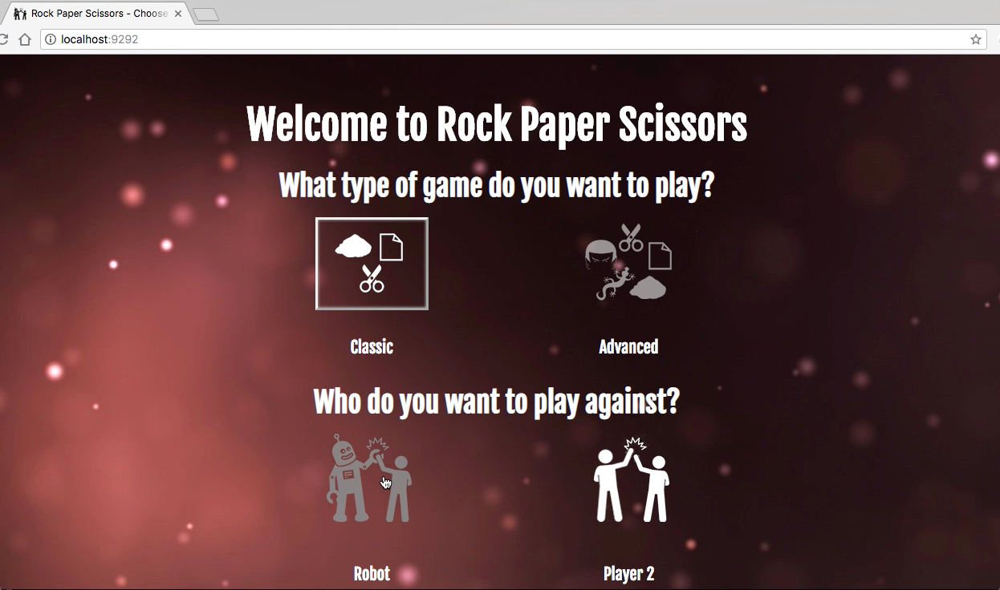
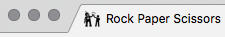
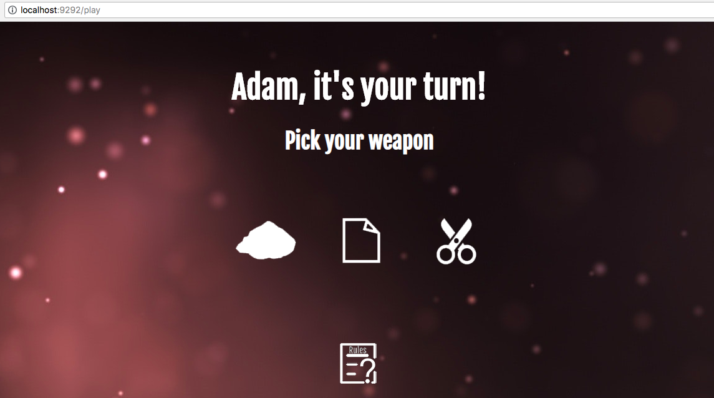
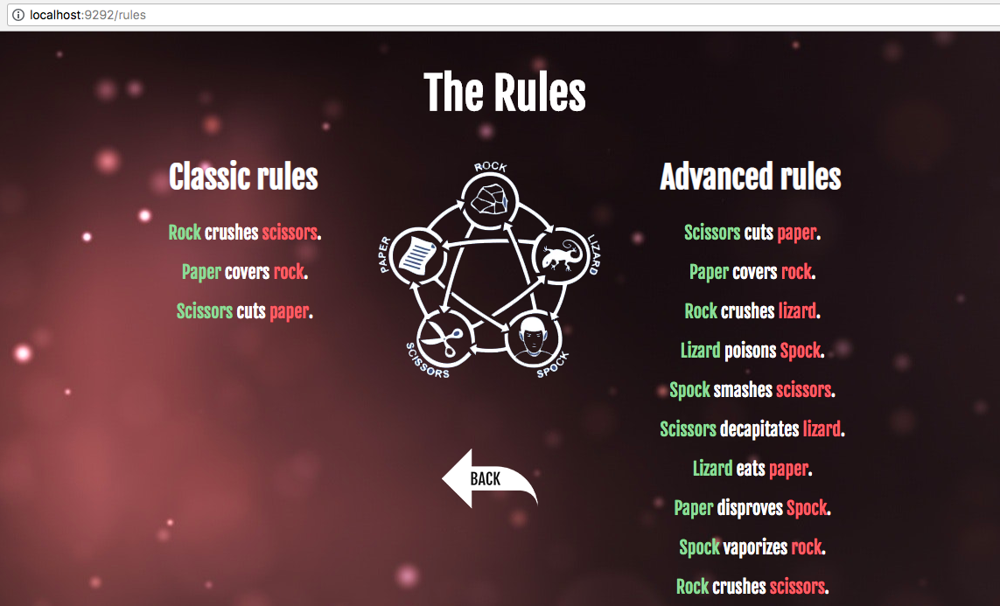
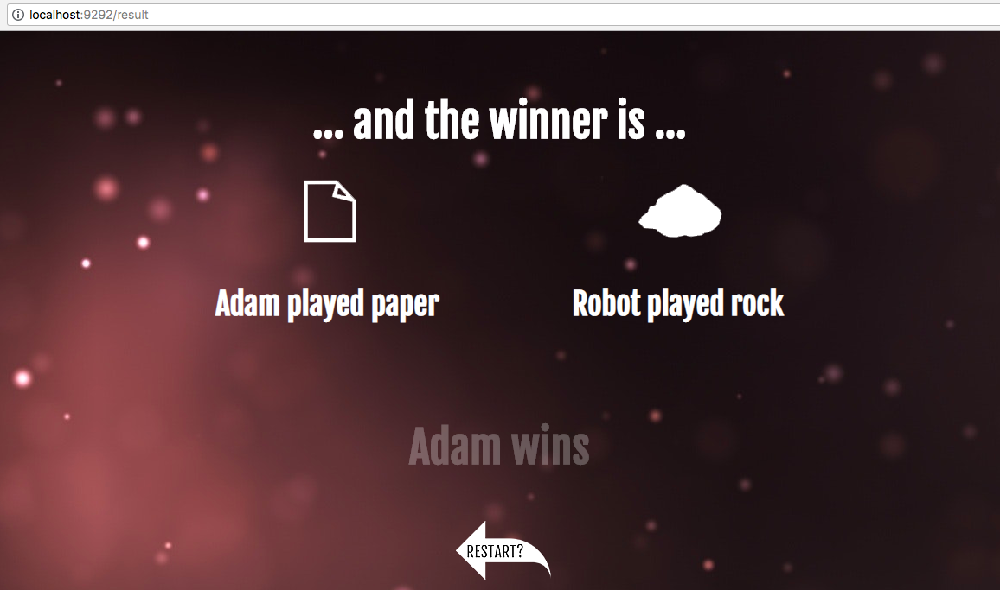

# RPS Challenge

- [RPS Challenge](#rps-challenge)
  * [Task](#task)
    + [Bonus level 1: Multiplayer](#bonus-level-1--multiplayer)
    + [Bonus level 2: Rock, Paper, Scissors, Spock, Lizard](#bonus-level-2--rock--paper--scissors--spock--lizard)
    + [Basic Rules](#basic-rules)
  * [Finished product](#finished-product)
  * [My approach](#my-approach)
  * [How to install/run](#how-to-install-run)
  * [Game details](#game-details)
  * [Test Results](#test-results)

Task
----
 
Knowing how to build web applications is getting us almost there as web developers!

The Makers Academy Marketing Array ( **MAMA** ) have asked us to provide a game for them. Their daily grind is pretty tough and they need time to steam a little.

Your task is to provide a _Rock, Paper, Scissors_ game for them so they can play on the web with the following user stories:

```sh
As a marketeer
So that I can see my name in lights
I would like to register my name before playing an online game

As a marketeer
So that I can enjoy myself away from the daily grind
I would like to be able to play rock/paper/scissors
```

Hints on functionality

- the marketeer should be able to enter their name before the game
- the marketeer will be presented the choices (rock, paper and scissors)
- the marketeer can choose one option
- the game will choose a random option
- a winner will be deAdamd


## Bonus level 1: Multiplayer

Change the game so that two marketeers can play against each other ( _yes there are two of them_ ).

## Bonus level 2: Rock, Paper, Scissors, Spock, Lizard

Use the _special_ rules ( _you can find them here http://en.wikipedia.org/wiki/Rock-paper-scissors-lizard-Spock_ )_

## Basic Rules

- Rock beats Scissors
- Scissors beats Paper
- Paper beats Rock

---

## Finished product - click on image to view video

[](http://www.youtube.com/watch?v=214c3RVzyqs "Game Demo")

## My approach
Created in Ruby as a demo in creating a web app using Sinatra and Capybara.  I also used this an opportunity to play with some front end code and the majority of they styling of the page is done with css

I probably got a bit too into the front end side of this challenge, even creating a favicon:   



But I really enjoyed it.

I was able to implement the additional two bonus challenges; multiplayer, and rock paper scissors lizard spock.  Due to the way I implemented the solution, it would be relatively easy to add in further variants - as long as there was a clear win/lose logic.

## How to install/run

- Run `bundle install` to install the gems needed for the game
- Run `rackup` to start the local server
- Go to http://localhost:9292

## Game details

You can choose to play classic rock paper scissors, or the advanced variant, rock paper scissors lizard spock.


You can also decide to play against a robot or against another player for both variants of the game.

Once the options are selected you are prompted to enter the player details (leaving this blank will default the names to Player 1 and Player 2 respectively)


You then pick which weapon you want to play



you can check out the details of what each option wins and loses to by going to `/rules` - available on the weapon selection screen.



Finally, you will see the results and a winner is declared



## Test Results
`100% coverage`

`100% Rubocop pass`
