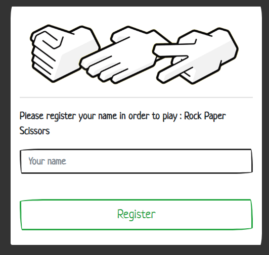
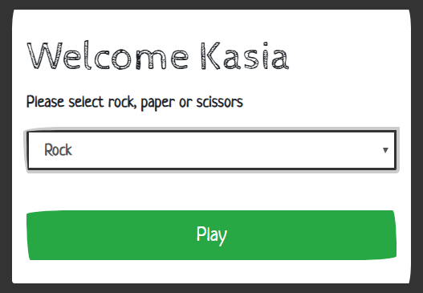
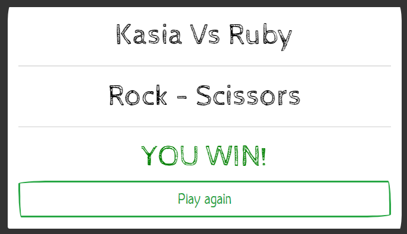

# RPS Challenge #

**Rock - Paper - Scissors: Makers Academy weekend challenge**
-------

I have enjoyed this project very much and decided to deploy my application to heroku.

[Click here to check it out!](https://rock-paper-and-scissors.herokuapp.com/)

I have used following tools and technologies to create the game:

* Ruby / Sinatra
* HTML / CSS
* Bootswatch
* RSpec & Capybara for testing
* Rubocop

I was aiming for:

* Complete TDD process ✔
* 100% test coverage ✔
* No offences from rubocop ✔
* Cool user interface ✔

-----
**Please see below screenshots of the application:**

-----

1. Registration UI



2. Selecting Rock, Paper or Scissors



3. And of course winning!



------

Task (please read for general rules and challenge details)
----

Knowing how to build web applications is getting us almost there as web developers!

The Makers Academy Marketing Array ( **MAMA** ) have asked us to provide a game for them. Their daily grind is pretty tough and they need time to steam a little.

Your task is to provide a _Rock, Paper, Scissors_ game for them so they can play on the web with the following user stories:

```sh
As a marketeer
So that I can see my name in lights
I would like to register my name before playing an online game

As a marketeer
So that I can enjoy myself away from the daily grind
I would like to be able to play rock/paper/scissors
```

Hints on functionality

- the marketeer should be able to enter their name before the game
- the marketeer will be presented the choices (rock, paper and scissors)
- the marketeer can choose one option
- the game will choose a random option
- a winner will be declared


As usual please start by

* Forking this repo
* TEST driving development of your app

## Basic Rules

- Rock beats Scissors
- Scissors beats Paper
- Paper beats Rock

In code review we'll be hoping to see:

* All tests passing
* High [Test coverage](https://github.com/makersacademy/course/blob/master/pills/test_coverage.md) (>95% is good)
* The code is elegant: every class has a clear responsibility, methods are short etc.

Reviewers will potentially be using this [code review rubric](docs/review.md).  Referring to this rubric in advance may make the challenge somewhat easier.  You should be the judge of how much challenge you want this weekend.
