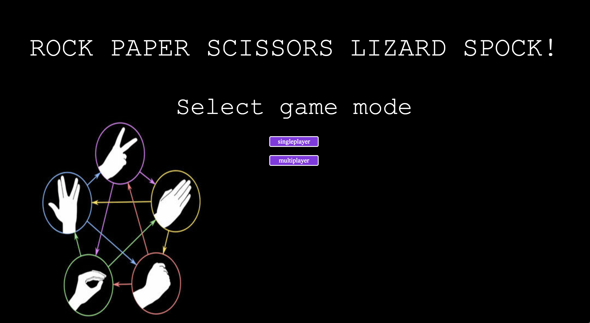
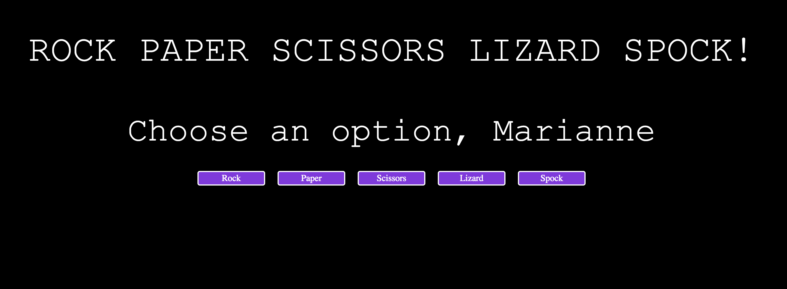
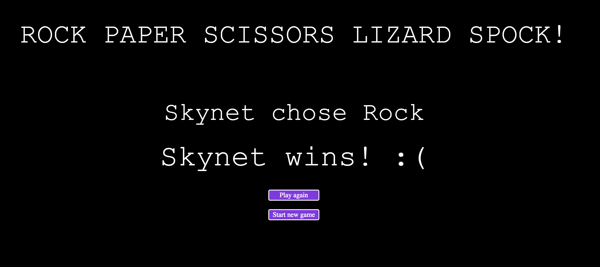
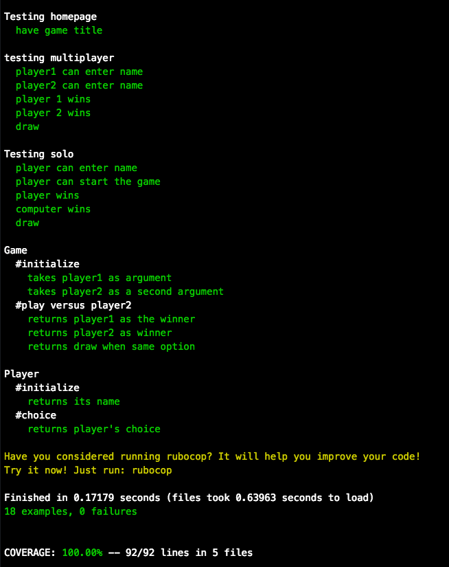

# RPS Challenge

[User Stories](#user-stories) | [Game Rules](#rules) | [Technologies](#technologies) | [User Interaction and Interaction](#experience) | [Running the App](#running-app) | [Running tests](#tests) | [Approach](#approach) | [Contributing](#contributing) 

<a name="user-stories">User stories</a>
----

```sh
As a marketeer
So that I can see my name in lights
I would like to register my name before playing an online game

As a marketeer
So that I can enjoy myself away from the daily grind
I would like to be able to play rock/paper/scissors
```

<a name="rules">Game Rules</a>
---

- Rock beats Scissors
- Scissors beats Paper
- Paper beats Rock
- Lizard beats Paper
- Lizard beats Spock
- Spock beats Rock
- Spock beats Scissors
- Rock beats Lizard
- Scissors beats Lizard
- Paper beats Spock

<a name="technologies"> Technologies</a>

- Ruby
- RSpec
- Capybara
- CSS

<a name="experience"> User Interaction and Experience</a>







<a name="running-app"> Running the app</a>

- Clone this repository
```
$ git clone https://github.com/m-rcd/rps-challenge
$ cd rps-challenge
```
- Install dependencies:
```
$ gem install
```
- Run the app
```
$ rackup
```
- In your browser, go to
```
localhost:9292
```

<a name="tests">Running the tests</a>
- Run
```
$ rspec
```



<a name="approach">Approach</a>
---

- Using TDD, I started by creating a web app that allow the user to enter their name and choose rock, paper or scissors.
- I then created a file called game.rb which contained the game logic.
- I also added a player class to allow the user to have a name
- I added a computer class which choose an option randomly.
- I then added a result page which would declare the winner
- I added a button that allows the user to play again
- I added the option to play a multiplayer game: 2 players can add their names, each choose an option and then see the winner
- I then added 2 options to the game: lizard and Spock
- I added the option to start a new game after a game ends
- Having finished implementing its functionality ,I used css to make it look nice

<a name="contributing"> Contributing</a>
---

Pull Requests are always welcome.

When you edit the code, please run `rspec` to check all the tests pass. Also run `rubocop` before you git commit.

Ensure the PR description clearly describes the problem and solution. It should include the relevant issue number, if applicable.


[Play now!](https://stark-journey-20582.herokuapp.com/)
