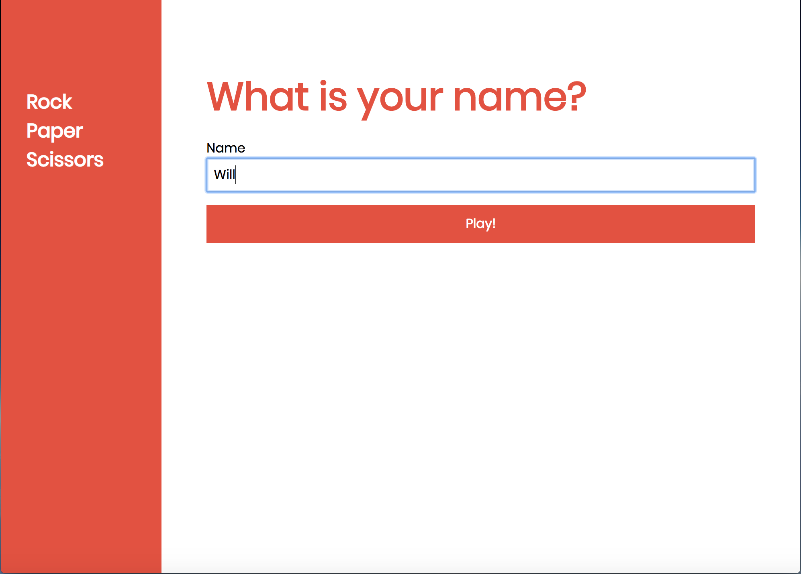

# RPS Challenge

## The Task

The task was to design a _Rock, Paper, Scissors_ game, following these user stories:

```sh
As a marketeer
So that I can see my name in lights
I would like to register my name before playing an online game

As a marketeer
So that I can enjoy myself away from the daily grind
I would like to be able to play rock/paper/scissors
```

## Downloading and setting up the repo

```sh
$ git clone git@github.com:nepeanwjdw/rps-challenge.git
$ cd rps-challenge
$ bundle
$ rackup config.ru
```

## What to expect

Enter your name


Choose your weapon


See the result. Options on the sidebar will let you play again or return to the home page

