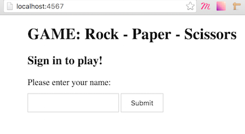
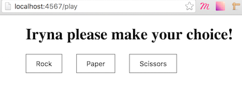
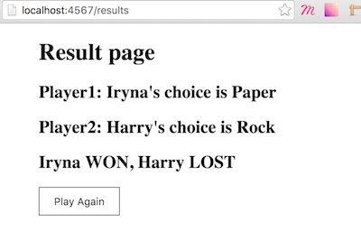

Rock-Paper-Scissors Challange
=================================

Week 3 weekend challenge to create an web application to play the game "Rock-Paper-Scissors".
More information about the task can be found [here](INSTRUCTIONS.md)

Features
--------

* player should be able to register their name before the start of the game
* player should be provided with avaliable game choices
* player should choose one of the provided choices
* player should be able to play with computer, who will imitate another player and make its own choice
* player should see result of his choice in comparison with other player (or computers) choice

Technologies & Principles
-------------------------

* Ruby
* Sinatra
* Capybara
* OOD, TDD, SOLID
* Testing with RSpec

Example of using the System
-----------------------------
| Step1 | Step2 | Step3 |
|-----------------|---------------|---------------|
|  |  |  |

Implementation
-----------------

Code is finished to play basic game against computer.

Main functionality implemented:

### Player
| Functionality | Descriprion |
|-----------------|---------------|
| Register name | Enter their name before start playing |
| Make choice | Select thier option from provided choices |

### Computer
| Functionality | Descriprion |
|-----------------|---------------|
| Return name | from list of names to imitate real player |
| Auto choice | make automatic choice to play against player |

### Game
| Functionality | Descriprion |
|-----------------|---------------|
| Add player| add player to the game|
| Default Rules | has basic rules to start with |
| Accept Rules | can accept more advanced rules if provided |
| Decide Result | return result of the game based on both players choices |

What can to be improved
-----------------------

* multyplayer option
* advance rules of the game (Rock, Paper, Scissors, Spock, Lizard)
