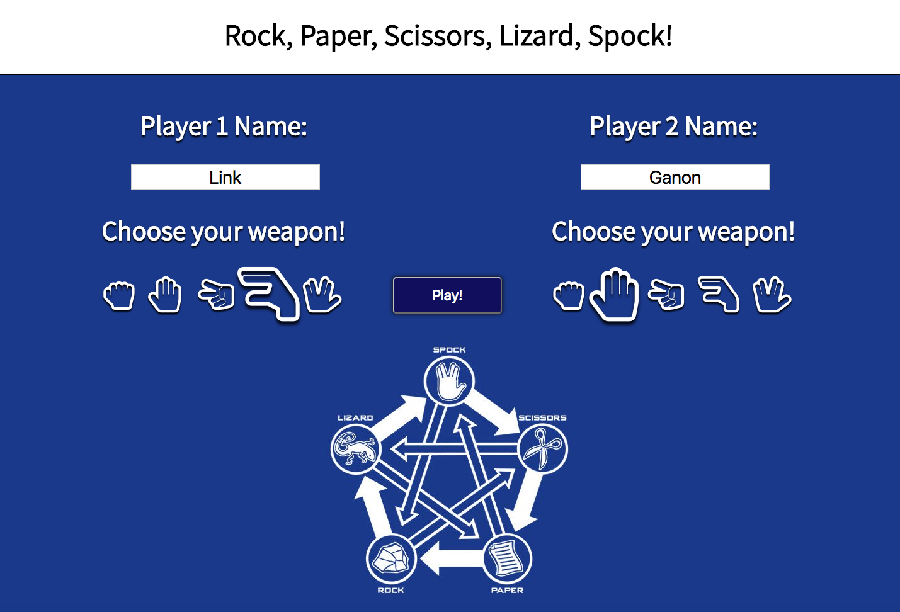
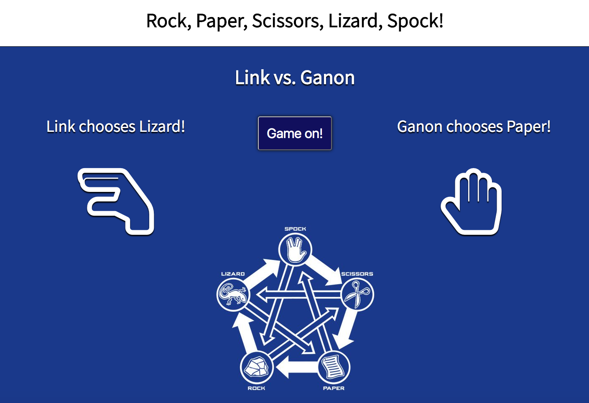
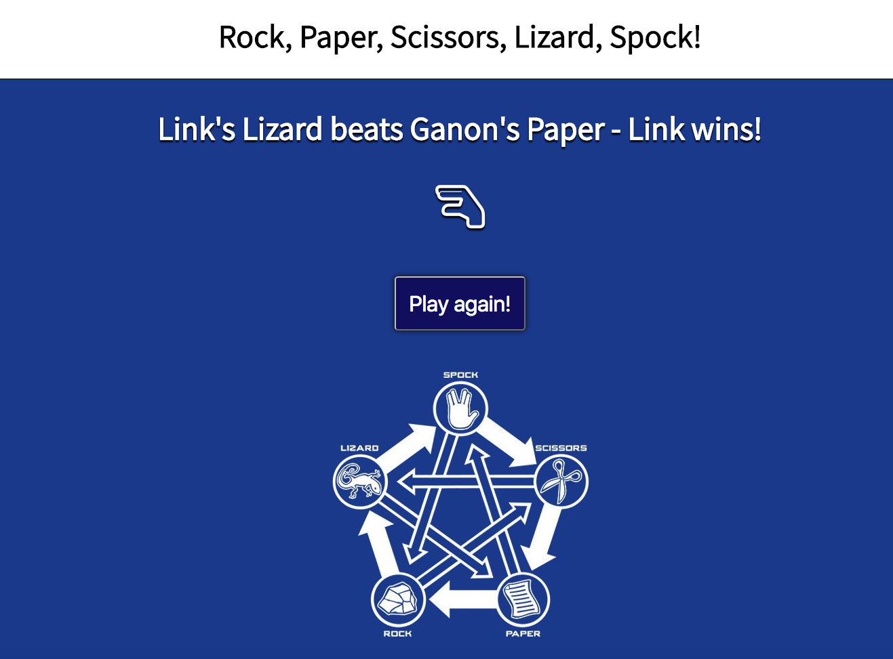

# Rock, Paper, Scissors, Lizard, Spock

[](https://travis-ci.org/treborb/rps-challenge)
[](https://codecov.io/gh/treborb/rps-challenge)

## [Makers Academy](http://www.makersacademy.com) - Week 3 - Solo Weekend Challenge

## Technologies
* [Ruby v2.3.3](https://www.ruby-lang.org/en/)
* [Sinatra](http://www.sinatrarb.com/)
* [Rspec](http://rspec.info/)

## Jump To
* [Game Rules](#rules)
* [Installation](#install)
* [Usage](#usage)
* [Tests](#tests)
* [Heroku Demo](https://rock-paper-scissors-liz-spk.herokuapp.com)
* [Screenshots](#screenshots)

## The brief

The Makers Academy Marketing Array ( **MAMA** ) have asked us to provide a game for them. Their daily grind is pretty tough and they need time to steam a little.

Your task is to provide a _Rock, Paper, Scissors_ game for them so they can play on the web with the following user stories:

```
As a marketeer
So that I can see my name in lights
I would like to register my name before playing an online game

As a marketeer
So that I can enjoy myself away from the daily grind
I would like to be able to play rock/paper/scissors
```

#### Required functionality

- the marketeer should be able to enter their name before the game
- the marketeer will be presented the choices (rock, paper and scissors)
- the marketeer can choose one option
- the game will choose a random option
- a winner will be declared

#### Bonus level 1: Multiplayer

Change the game so that two marketeers can play against each other ( _yes there are two of them_ ).

#### Bonus level 2: Rock, Paper, Scissors, Lizard, Spock

Use the _special_ rules [Wikipedia](http://en.wikipedia.org/wiki/Rock-paper-scissors-lizard-Spock)

## <a name="rules">Game Rules</a>

* Rock defeats Scissors and Lizard
* Paper defeats Rock and Spock
* Scissors defeats Paper and Lizard
* Lizard defeats Paper and Spock
* Spock defeats Scissors and Rock

## <a name="install">Installation</a>
```sh
$ git clone https://github.com/treborb/rps-challenge.git
$ cd rps-challenge
$ rvm 2.3.3
$ gem install bundler
$ bundle
$ rackup
$ open http://localhost:9292
```

## <a name="usage">Usage</a>

* Follow the installation instructions above, or view the demo on [Heroku](https://rock-paper-scissors-liz-spk.herokuapp.com)
* Enter your name and choose a weapon
* If you want a friend to play with you, have them enter their name and choose a weapon also
* If no second player is entered, you will play against the computer
* If no players are entered, the computer will play as both players
* Click the "Play!" button
* Have fun playing Rock, Paper, Scissors, Lizard, Spock!

## <a name="tests">Running the tests</a>
```sh
$ rspec
```

## <a name="screenshots">Screenshots</a>








