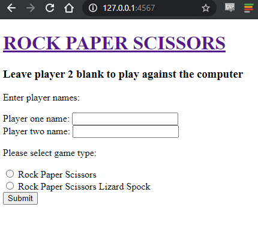

# ROCK PAPER SCISSORS  

## Instructions

1. clone to your system

2. run `bundle install` 

3. run `ruby app.rb`

4. open a web browser and navigate to `127.0.0.1:4567`

5. or view it on Heroku [here](https://roc-pap-sci.herokuapp.com/)

## Function

* Upon the page loading you'll be greeted with the new game screen, enter two names or just one to play against the computer. 

* Select the game type you want to play, traditional Rock-Paper-Scissors or 5 weapon Rock-Paper-Scissors-Lizard-Spock.

## Planning / Execution

* I tried to play from the outset with the stretch goals in mind, so I made sure that the logic for the RPS resolver would be able to handle any number of weapons that the game was set to. It can handle any number of odd number weapons.

* I followed the drop-in-CSS tutorial for [Sinatra](https://github.com/sinatra/sinatra) from [@webdevfejjus](https://github.com/webdevjeffus/css-for-sinatra) and added my own `application.css` with code of my own to complete the styling.

## Gems

* Nothing too special here, [Sinatra](https://github.com/sinatra/sinatra) web app using [Capybara](https://github.com/teamcapybara/capybara) for testing.