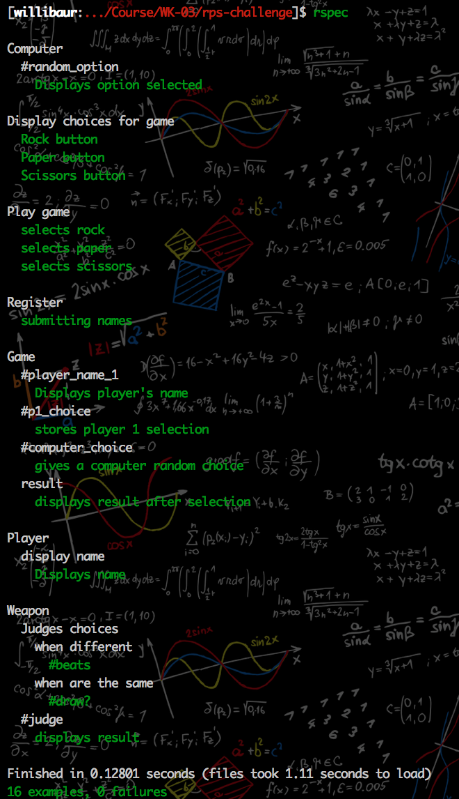

# RPS Challenge

## Task

Knowing how to build web applications is getting us almost there as web developers!

The Makers Academy Marketing Array ( **MAMA** ) have asked us to provide a game for them. Their daily grind is pretty tough and they need time to steam a little.

Your task is to provide a _Rock, Paper, Scissors_ game for them so they can play on the web with the following user stories:

```
As a marketeer
So that I can see my name in lights
I would like to register my name before playing an online game

As a marketeer
So that I can enjoy myself away from the daily grind
I would like to be able to play rock/paper/scissors
```

Hints on functionality

- the marketeer should be able to enter their name before the game
- the marketeer will be presented the choices (rock, paper and scissors)
- the marketeer can choose one option
- the game will choose a random option
- a winner will be declared

## How To Use The App

### Web-based

Directly playable at: https://rps-fun.herokuapp.com/

### Local

Clone the repo & cd into program directory

```
git clone git@github.com:s-palmer/rps-challenge.git
```

If you don't have bundler installed:
```
gem install bundler
```
Then run:
```
bundle install
```
Local server can be started by running:
```
rackup
```
The app should be usable at localhost:9292.

## Basic Rules

- Rock beats Scissors
- Scissors beats Paper
- Paper beats Rock

## STACK

|                                                        | Tool                                                 | Use?                                                                                    |
|--------------------------------------------------------|------------------------------------------------------|--------------------------------------------|----------------------------------------------------------------------|
|        | [RSpec](https://rspec.info/)                         | Testing tool for Ruby.       |
|     | [Capybara](https://github.com/teamcapybara/capybara) | Acceptance test framework for Ruby.|                      |
|         | [Ruby](https://www.ruby-lang.org/en/)                | Programming language.  |       
|      | [Sinatra](http://sinatrarb.com/)                     | DSL for quickly making web apps with Ruby.|


