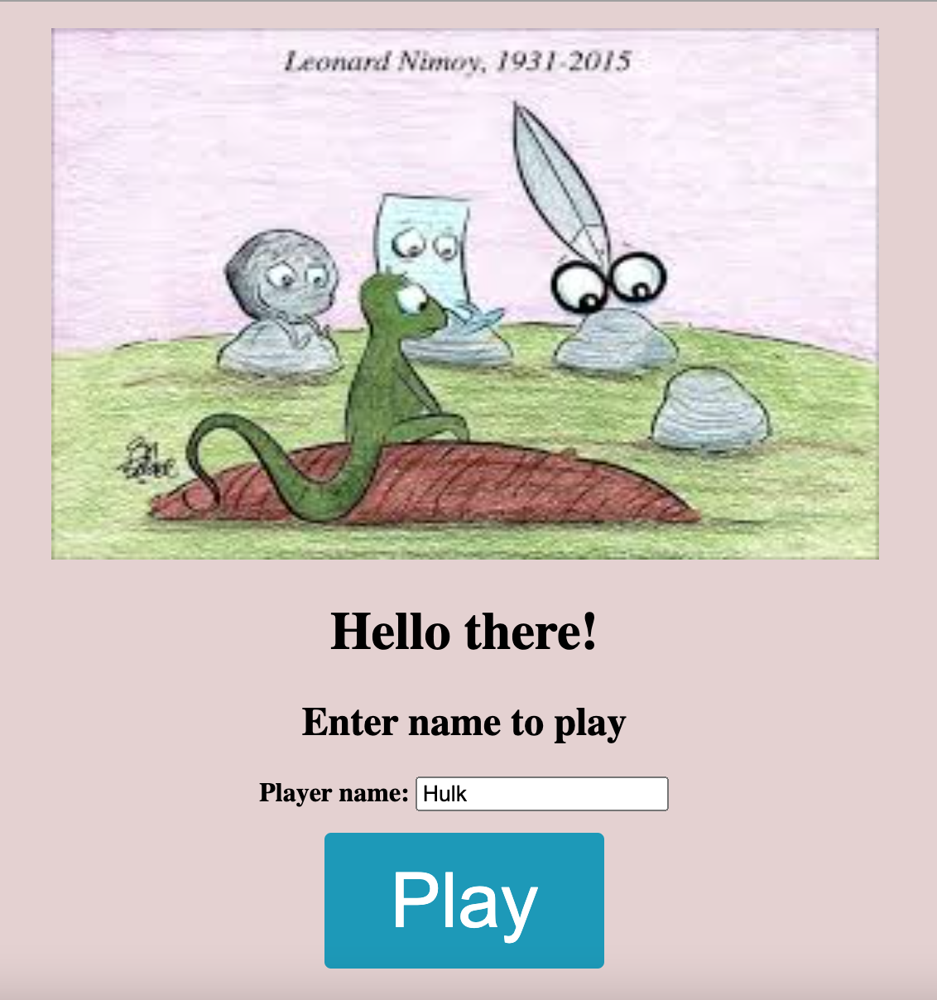
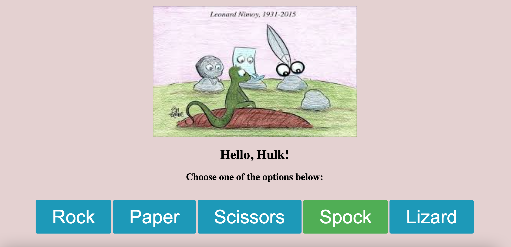
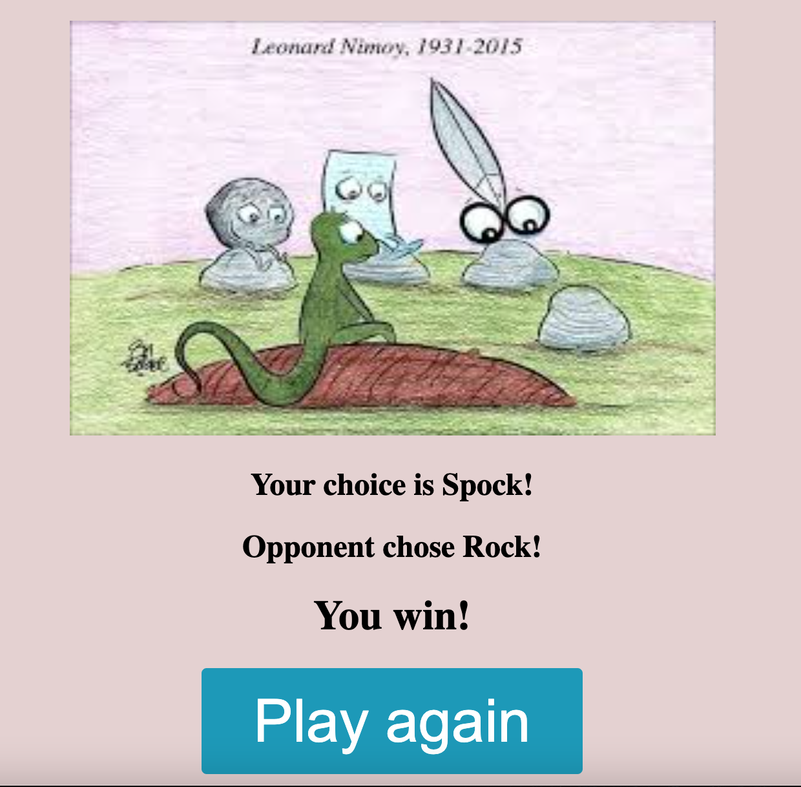

# RPS Challenge

# Rock Paper Scissors

  

---

# Introduction

The intention of this project was to build a working implementation of the popular game Rock, Paper Scissors.

This is an individual project created for the Makers Academy week 3 weekend challenge.

This project was built using Ruby, and was structured around the Sinatra framework. The Rspec testing framework was implemented to provide feature and unit testing capabilities, and Capybara was included to allow for testing of front-end elements.

The learning intentions for this project revolved around Sinatra, Rspec and Capybara, and at this point in the Makers Academy curriculum databases have not yet been covered. Due to this global variables have been implemented throughout to assist with persistence, although we have been made well aware that the use of global variables is far from best practice, and that once databases have been addressed we should no longer use them in almost all circumstances.

---

## Bonus level 1: Multiplayer

Change the game so that two marketeers can play against each other ( yes there are two of them ).

## Bonus level 2: Rock, Paper, Scissors, Spock, Lizard

Use the special rules ( you can find them here http://en.wikipedia.org/wiki/Rock-paper-scissors-lizard-Spock )

# Technology

- Ruby
- Twilio
- Rspec

---

### Functions

1. Register player name
2. Choose rock, paper, scissors, spock or lizard
3. Multiple players: Play against computer
4. View result - win, lose or draw
5. Play again!

---

### How to use

# Setup

1. Install Ruby (version 2.6.5 or above)
2. Clone this depository and navigate to the root folder
3. Run the command `gem install bundle` (if you don't have bundle already)
4. When the installation completes, run `bundle`

# How to run

2. Run command `rackup` or `ruby app/app.rb` to start the local server
3. In web browser, enter i.e. "localhost:9292" (or the port provided from previous step)

---

### Future Scope

- Add more than 2 players
- Make more interactive using Javascript
- Host on cloud
