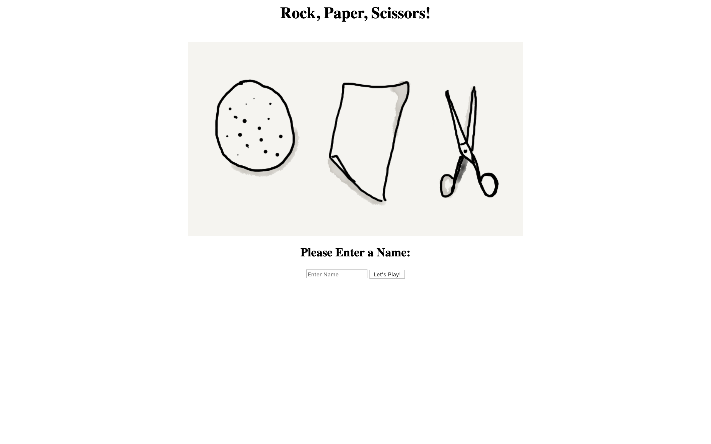
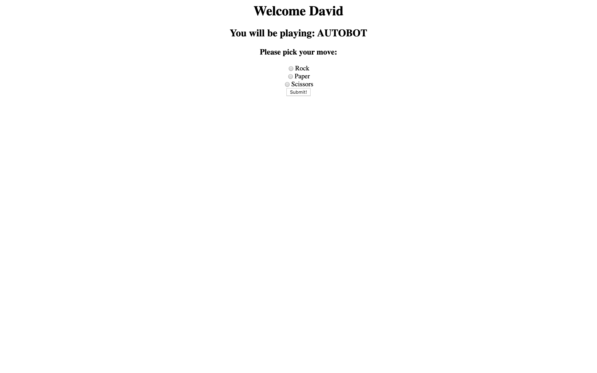
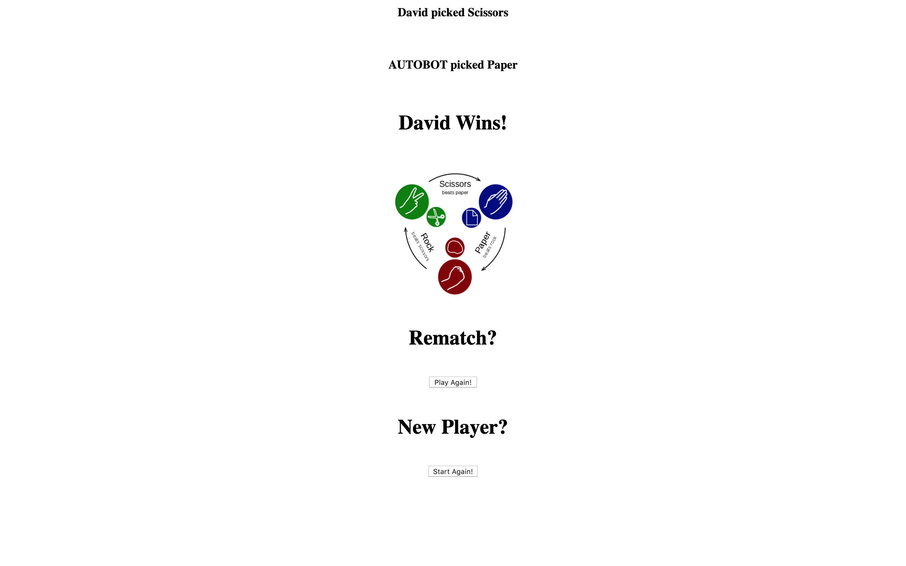

# RPS Challenge

This was the third weekend challenge at Makers. It reinforced what I had learnt in the weeks work - how to build a basic web app using MVC architecture. The `model` in this app holds the logic in .rb files, the `controller` uses sinatra to display the required information in seperate paths, and the `views` contain the .erb files that display the html on the browser.

I followed the brief when making this web based classic game:

The user is able to select a name, it then welcomes them onto the next page with their name displayed, and the name of the computer they are playing against (randomly selected). You are then given options (via a radio form) to select Rock, Paper, or Scissors, after which you submit your choice. It then tells you what you selected, what the computer selected, and finally if you won, lost or the game was a draw. It then has an option to return to the start and play again under the same user profile, or to star over with a new user.

---

## How To Run

Clone this repo, navigate to this directory and in the command line type:

```
bundle istall
```

Once the dependancies are installed, type into the command line:

```
rackup
```

Then visit [_localhost:9292_](http://localhost:9292/) to run the app locally.

To run the test suite (**RSpec** and **Capybara**), in the command line type:

```
rspec
```

This will display 9 passing tests with 100% coverage.

---

## Brief

Your task is to provide a _Rock, Paper, Scissors_ game that a user can play on the web. This game will be based onthe following user stories:

```
As a marketeer
So that I can see my name in lights
I would like to register my name before playing an online game

As a marketeer
So that I can enjoy myself away from the daily grind
I would like to be able to play rock/paper/scissors
```

**Hints on functionality**

- The marketeer should be able to enter their name before the game.
- The marketeer will be presented the choices (rock, paper and scissors).
- The marketeer can choose one option.
- The game will choose a random option.
- A winner will be declared.

**Basic Rules**

- Rock beats Scissors
- Scissors beats Paper
- Paper beats Rock

---

### Homepage



### Game Screen



### Declaration Screen


