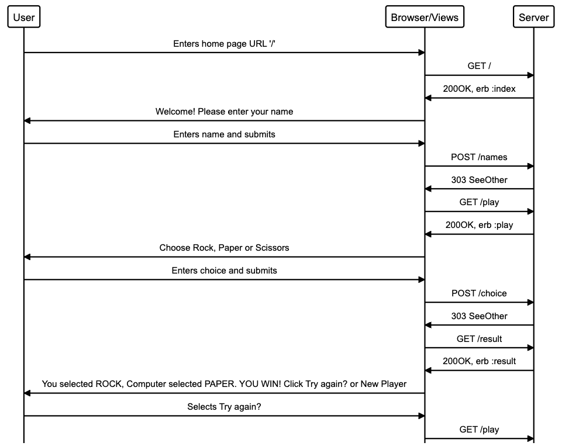

# RPS Challenge


Task
----

Knowing how to build web applications is getting us almost there as web developers!

The Makers Academy Marketing Array ( **MAMA** ) have asked us to provide a game for them. Their daily grind is pretty tough and they need time to steam a little.

Your task is to provide a _Rock, Paper, Scissors_ game for them so they can play on the web with the following user stories:

```
As a marketeer
So that I can see my name in lights
I would like to register my name before playing an online game

As a marketeer
So that I can enjoy myself away from the daily grind
I would like to be able to play rock/paper/scissors
```

Hints on functionality

- the marketeer should be able to enter their name before the game
- the marketeer will be presented the choices (rock, paper and scissors)
- the marketeer can choose one option
- the game will choose a random option
- a winner will be declared


As usual please start by

* Forking this repo
* TEST driving development of your app


## How I got started

- I forked to my github, then cloned to my machine. I ran `bundle install` to install those dependencies to my project.
- I created an `app.rb` file in the root of my project. Inside `app.rb`, I have set up to use Sinatra's [Modular Style]. Defining apps like this at the top level is only suitable for micro-applications. Sinatra is a DSL for quickly creating web applications in Ruby with minimal effort.
```ruby
# in app.rb

require 'sinatra/base'

class RPS < Sinatra::Base

  # start the server if ruby file executed directly
  run! if app_file == $0
end
```
-  There are two common options for starting a modular app. 1) The  server starts if the ruby file 'app.rb' is run directly. 2) Or with a `config.ru` file, which allows using any Rack handler.
- I therefore created a `config.ru` (rackup file) in the root of my project, which allows my app.rb to be run using any Rack handler. The console outputs a port and we use that to create a URL like `localhost:XXXX`.
```
require_relative "./app"
run RPS
```
- As per the instructions, I ensured I have the following **AT THE TOP** of my spec_helper.rb in order to have test coverage stats generated on my pull request:

```ruby
require 'simplecov'
require 'simplecov-console'

SimpleCov.formatter = SimpleCov::Formatter::MultiFormatter.new([
  SimpleCov::Formatter::Console,
  # Want a nice code coverage website? Uncomment this next line!
  # SimpleCov::Formatter::HTMLFormatter
])
SimpleCov.start
```
- I added this to tell Capybara about my app class:
```ruby
require 'capybara/rspec'
require './app'

Capybara.app = RPS
```

## Spend time planning
I had committed to spending more time in the planning and diagramming stage so here it is. I tried to visualise what will happen. This is not the correct way to draw a sequence diagram but it helped me think about the different steps.



