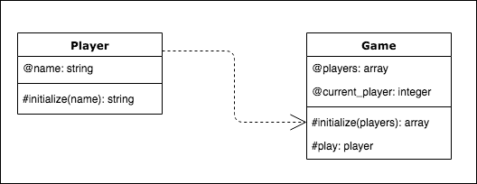

## RPS Challenge
##### *(Makers Academy - Week 2)*

### [Introduction](#introduction) | [Approach](#approach) | [Setup](#setup) | [Run](#run) | [Examples](#examples)

## Introduction
This is the third weekend challenge at the 12 week [Makers Academy](https://makers.tech/) bootcamp. Working individually the task was to create a web application to play **Rock Paper Scissors** based on the following user stories:
```
As a marketeer
So that I can see my name in lights
I would like to register my name before playing an online game

As a marketeer
So that I can enjoy myself away from the daily grind
I would like to be able to play rock/paper/scissors
```

Functional specifications:
* the marketeer should be able to enter their name before the game
* the marketeer will be presented the choices (rock, paper and scissors)
* the marketeer can choose one option
* the game will choose a random option
* a winner will be declared

#### Bonus level 1: Multiplayer

Change the game so that two marketeers can play against each other ( _yes there are two of them_ ).

#### Bonus level 2: Rock, Paper, Scissors, Spock, Lizard

Use the _special_ rules _(you can find them here http://en.wikipedia.org/wiki/Rock-paper-scissors-lizard-Spock)_

### Approach
1. Diagram classes and methods
2. Write Rspec unit tests for classes and methods
3. Make unit tests pass
4. Write feature tests for using capybara
5. Make feature tests pass
6. Refactor

##### diagram


## Setup

<!-- ##### prerequisites -->

<!-- * [ngrok](https://ngrok.com/) installed locally.
For Macs users use [homebrew](https://brew.sh/).
```
$ brew cask install ngrok
```
* registered [twilio](https://www.twilio.com/) account -->

##### clone  and install
```
$ git clone https://github.com/toddpla/rps-challenge.git

$ bundle
```

<!-- ## Run

##### start local server

```
$ ruby './lib/twilio.rb'
``` -->


<!-- [](https://asciinema.org/a/m0s3gCALX6e3tb2qDwy0RwQzx) -->
