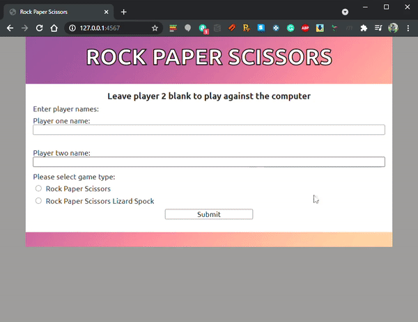

# ROCK PAPER SCISSORS  

## Instructions

1. clone to your system

2. run `bundle install` 

3. run `ruby app.rb`

4. open a web browser and navigate to `127.0.0.1:4567`

## Function

* Upon the page loading you'll be greeted with the new game screen, enter two names or just one to play against the computer. 

* 