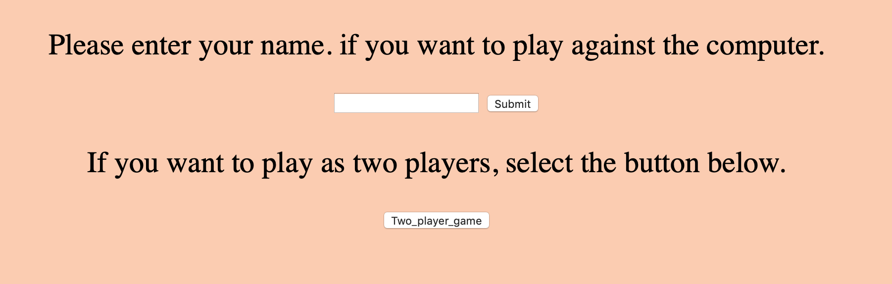
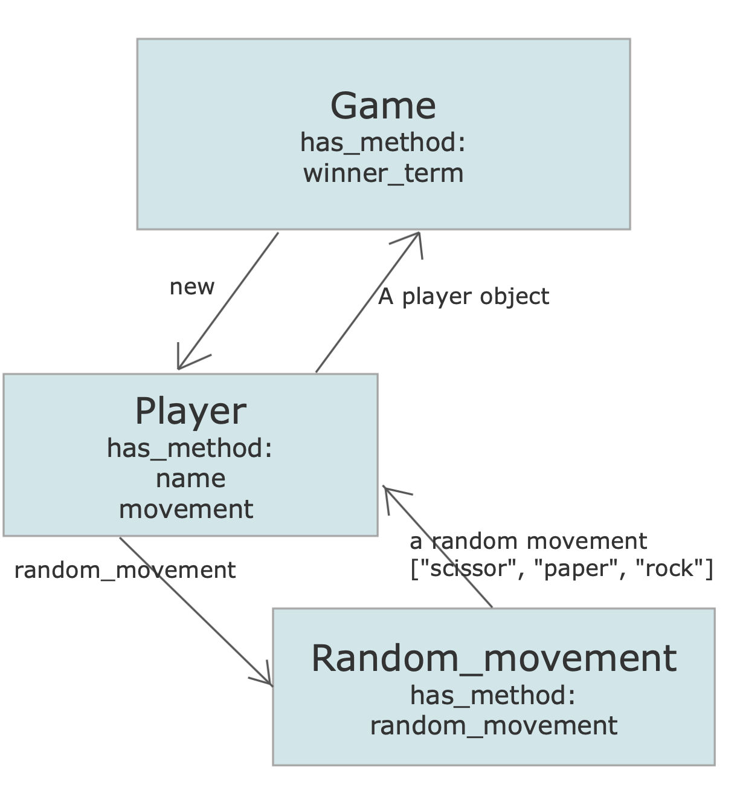

# RPS Challenge


In the current repository, you can use the created  web application to play Rock/Paper/Scissors either against the  computer or against another player.  

In order to play the game, fork or clone the repository.

https://github.com/soroushh/rps-challenge.git

Then run the following command in terminal in order to install the required gems and dependencies.

``` bundle install ```

After installing all the gems, you can go into the repository's directory and run the application file by the following command:

``` ruby rsp_app.rb ```

Then, you can open your browser and play the game by opening the URL:

``` localhost:4567 ```

## Technologies used

Ruby

Sinatra

RSpec and Capybara as test frameworks

Simplecov for calculating test coverage

Rubocop as a linter

## How to play the game:


### 1. Solo game (against computer)
After running the ``` rsp_app.rb ``` file in your terminal and opening the ``` localhost:4567 ``` in your browser, you will see the following picture:



If you want to play solo (against computer), you can enter your name and submit it at the first page. Then, you will be asked for your movement and the computer will get a random movement. Depending on your movement and the computer's random movement, you will lose, win or the game will be equal.

### 2. Two player game

If you want to play the game as two players, you should choose the "Two_player_game" button at the first page of the application. Then, the name of the players and their movements will be asked in order to specify the winner of the game.

## Instructions
-------

The model of the exercise is shown in the following picture:


## Task
----

Knowing how to build web applications is getting us almost there as web developers!

The Makers Academy Marketing Array ( **MAMA** ) have asked us to provide a game for them. Their daily grind is pretty tough and they need time to steam a little.

Your task is to provide a _Rock, Paper, Scissors_ game for them so they can play on the web with the following user stories:

```sh
As a marketeer
So that I can see my name in lights
I would like to register my name before playing an online game

As a marketeer
So that I can enjoy myself away from the daily grind
I would like to be able to play rock/paper/scissors

As a marketeer
So that I can enjoy my time with my friend
I would like to be able to play the game against my friend.
```

## Hints on functionality

### In solo game

- the marketeer should be able to enter their name before the game
- the marketeer will be presented the choices (rock, paper and scissors)
- the marketeer can choose one option
- the game will choose a random option
- a winner will be declared

### In two player game

- The players should be able to enter their names.
- The players will be presented the choices(rock, paper and scissors)
- The players can choose between the movements.
- The winner will be declared


## Basic Rules

- Rock beats Scissors
- Scissors beats Paper
- Paper beats Rock

Notes on test coverage
----------------------

Please ensure you have the following **AT THE TOP** of your spec_helper.rb in order to have test coverage stats generated
on your pull request:

```ruby
require 'simplecov'
require 'simplecov-console'

SimpleCov.formatter = SimpleCov::Formatter::MultiFormatter.new([
  SimpleCov::Formatter::Console,
  # Want a nice code coverage website? Uncomment this next line!
  # SimpleCov::Formatter::HTMLFormatter
])
SimpleCov.start
```

You can see your test coverage when you run your tests. If you want this in a graphical form, uncomment the `HTMLFormatter` line and see what happens!
