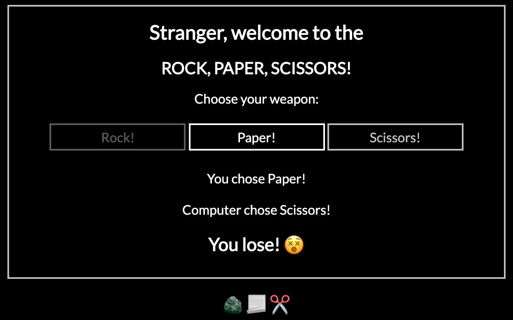

## RPS

Simple rock, paper, scissors game test driven developed in Ruby/Sinatra.

### How to setup

- Install Ruby 2.6.5
- Clone the git repository
- Run `bundle install`

### How to run the application
- Navigate to the root folder of the project
- Run `ruby app.rb`

### Screenshot of working application

### How to run the tests
- Navigate to the root folder of the project
- Run `rspec`

### Known issues
Failing computers' choice randomness test. 
