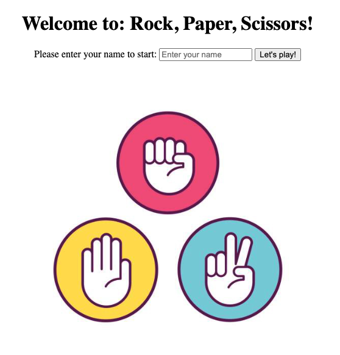
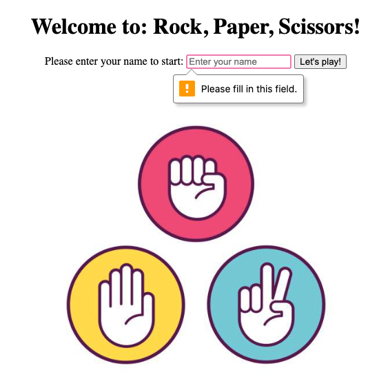
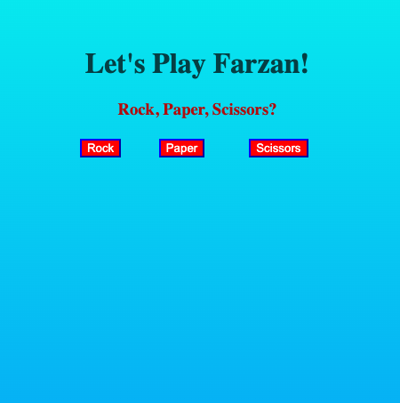
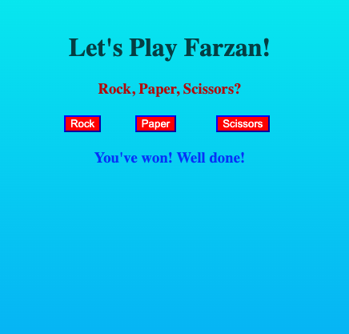
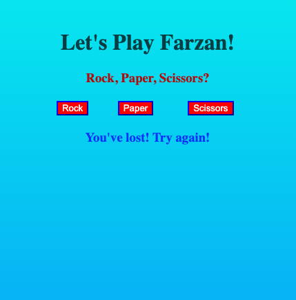
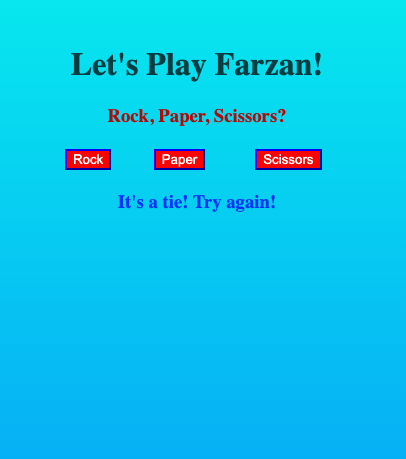

# Rock, Paper, Scissors Challenge

## Instructions to install and play the game
-------

* Clone this repo in your desired directory by doing the following in the terminal: 
```
git clone https://github.com/Farzan-I/rps-challenge.git
```
* Run `bundle` to install all the gemfiles 
* Run `rackup` in the directory, then go to your desired browser and enter:
```
localhost:9292
```
* Enter your name (if you don't you can't continue), click on "Let's play!" and play until your heart desires!

<br>

## Task
-------

The Makers Academy Marketing Array ( **MAMA** ) have asked to provide a game for them. Their daily grind is pretty tough and they need time to steam a little.

The task is to provide a _Rock, Paper, Scissors_ game for them so they can play on the web with the following user stories:

```
As a marketeer
So that I can see my name in lights
I would like to register my name before playing an online game

As a marketeer
So that I can enjoy myself away from the daily grind
I would like to be able to play rock/paper/scissors
```

Hints on functionality

- the marketeer should be able to enter their name before the game
- the marketeer will be presented the choices (rock, paper and scissors)
- the marketeer can choose one option
- the game will choose a random option
- a winner will be declared

## Basic Rules
-----

- Rock beats Scissors
- Scissors beats Paper
- Paper beats Rock

In code review we'll be hoping to see:

* All tests passing
* High [Test coverage](https://github.com/makersacademy/course/blob/main/pills/test_coverage.md) (>95% is good)
* The code is elegant: every class has a clear responsibility, methods are short etc.

Reviewers can potentially be using this [code review rubric](docs/review.md).

## Demo
-------
### Home page


### Home page error


### Battleground


### Battleground win


### Battleground loss


### Battleground draw



## Conclusion
-----
* I managed to make several files to be able to incorporate the classes and the tests that I needed
* These were split into features and unit test folders as well as a 'lib' folder to have all the game class as well as the player class
* The 'app.rb' file that has the specifications for the game is present in the parent folder to incorporate all of the spec and lib folder files in order to run the game
* I had difficulty trying to apply a gradient background on the home page and therefore made it a simple, slick white background
* I did however make the play page a gradient background and didn't apply an image
* I managed to make a button on the home page that is required to be filled in (name) in order for the player to access the battleground and select their weapon for Rock, Paper, Scissors
* On the play page, the buttons for the weapons I customised and would have preferred to have had more time to make them look slicker
* A message was given for when the player won, drew or lost to the computer - I would have tried to incorporate javascript to make the messages more dynamic and eye catching

## Improvements if not on a time constraint
-----
* Make the home page more eye catchy
* Allow the user to have a better experience i.e. see a better win/loss/draw message by using javascript and maybe CSS
* Make the buttons more appealing and less like 1990's/2000's style by using capybara properly and javascript with CSS
* Make the game two player by allowing two players to entrer their names on the home page and also select their weapons in the play area
* Incorporate the 'rock, paper, scissors, lizard, spock' and make the game more complicated and appealing

## Bonus level 1: Multiplayer - **_Did not complete_**

Change the game so that two marketeers can play against each other ( _yes there are two of them_ ).

## Bonus level 2: Rock, Paper, Scissors, Spock, Lizard - **_Did not complete_**

Use the _special_ rules ( _you can find them here http://en.wikipedia.org/wiki/Rock-paper-scissors-lizard-Spock_ )