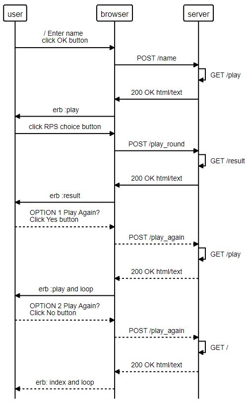

# Rock Paper Scissors Game with one player against the computer

I started with a sequence diagram which I refined towards the end to the following:

I built the functionality of the game using mainly session and params from hidden fields at each button choice, so there was no need for a Player class.

I appreciate that using a class variable for the @game is not necessary in a single player game, but I wanted to practice it and it may be useful if the finctionality expands and @game needs to be used across sessions. 

The game starts with prompting for a players name, the allows the player to make a choice between "Rock" , "Paper", "Scissors" buttons. 
It announces the players and the computer's choice and declares the winner or a tie.
The player is then asked if they want to play again, in which case they are asked for a new choice or if not, the game returns to the index page waiting for a new player name.

