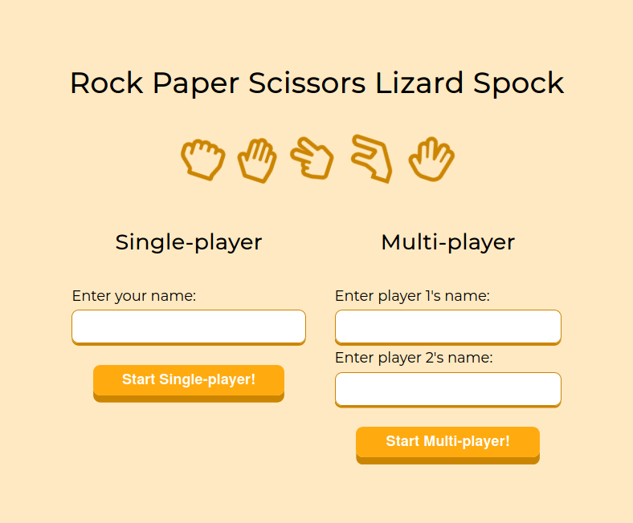
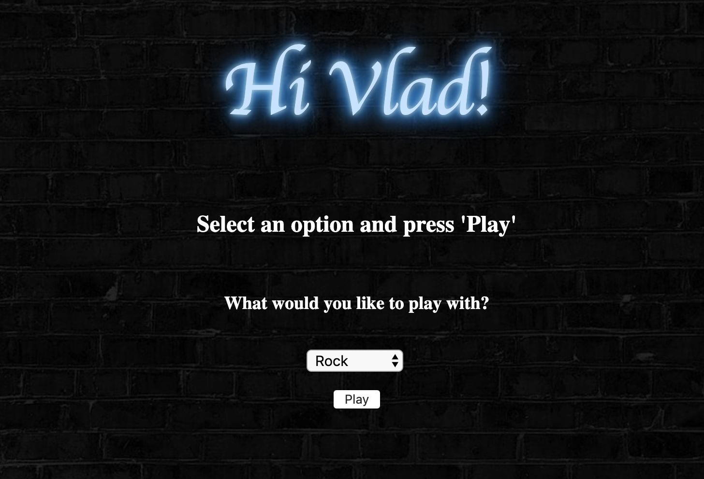
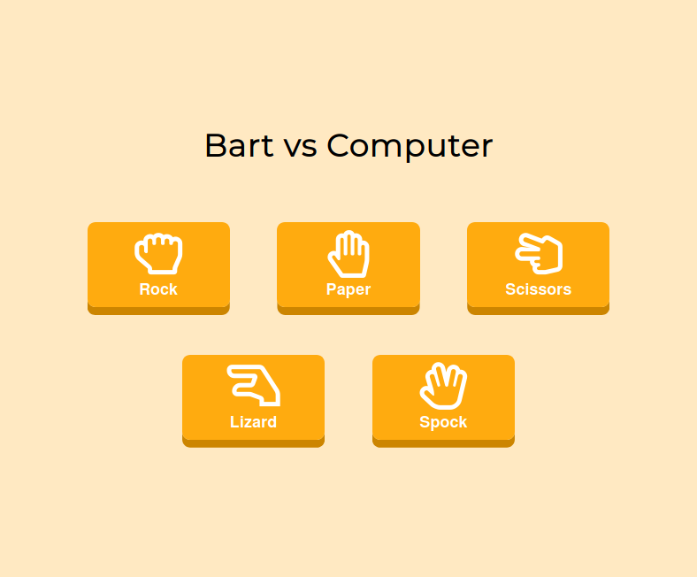

# Rock - Paper - Scissors Challenge

Task
----

The Makers Academy Marketing Array ( **MAMA** ) have asked us to provide a game for them. Their daily grind is pretty tough and they need time to steam a little.

My task was to provide a _Rock, Paper, Scissors_ game for them so they can play on the web with the following user stories:

This project is a Single Player Rock-Paper-Scissors game.






## Instructions for running the app :point_down:

Clone this repo:
```
$ git clone https://github.com/VladC24/rps-challenge.git
```

In the terminal, do the following:

```
$ cd rps-challenge
```
```
$ bundle
```
```
$ rackup
```

Go to your browser and enter in the address bar:
```
localhost:9292
```

## Basic Rules

- Rock beats Scissors
- Scissors beats Paper
- Paper beats Rock

### HAVE FUN!!!
