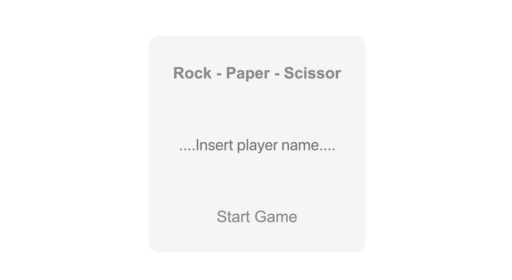
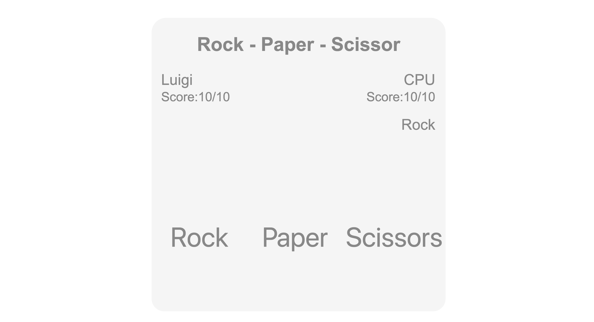
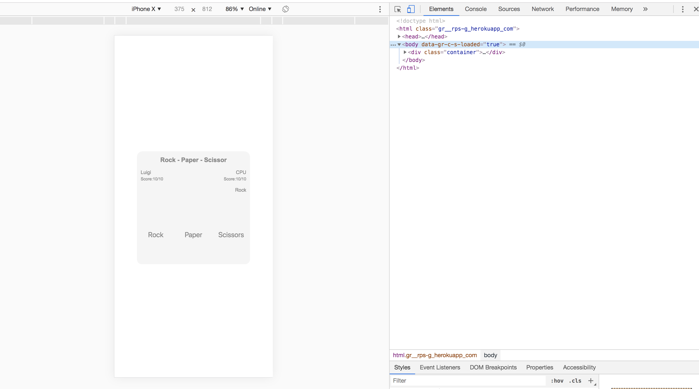

# ROCK - PAPER - SCISSORS

'Rock,Paper,Scissor' is a small back-end app part of the Makers Academy weekend challenges. It's written in Ruby that uses the game to explore the Model, View, Controller architecture. 

## Domain model

Player  --> Enter the domain URL  --> Page 
Page -->  shows -->  Game title, name box, submit button 
Player  -->  Enter -->  name 
Page -->  shows --> Game title, player name, rock paper scissors buttons 
Player  -->  Click -->  Rock button 
Page  -->  Shows  -->  CPU random choice and winner

## Getting started

* Please clone the repository typing on your terminal: `git@github.com:l-palermo/rps-challenge.git`
* Then run `bundle` to install dependecies
* To run tests: `$ rspec`
** Test coverage 100%

## How to use the software

* This app is deployed to Heroku. `https://rps-g.herokuapp.com`
* To run this app locally:
** Clone the repository typing on your terminal: `git@github.com:l-palermo/rps-challenge.git`
** Run `bundle` to install dependecies
** To run tests: `$ rspec` (Test coverage 100%)
** From the folder `RPS-CHALLENGHE` run on the cmd line:`$ rackup`, move to the browser and in the URL line type: `http://localhost:9292/`

### Example of usage

