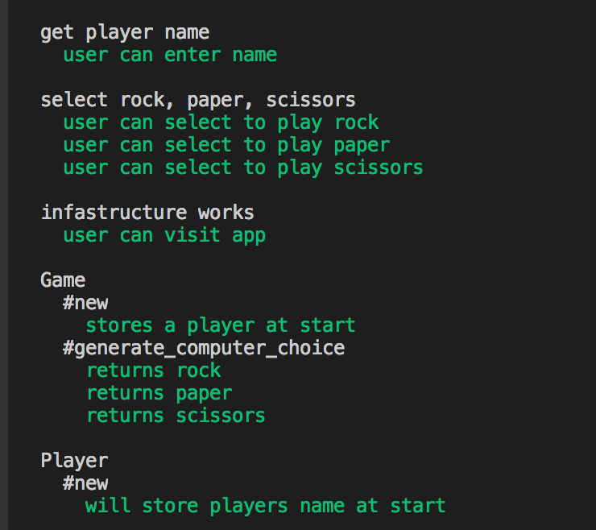

# RPS Challenge

Description
-------
This Rock, Paper, Scissor is a [Sinatra modualar application](https://www.oreilly.com/library/view/sinatra-up-and/9781449306847/ch04.html). It allows the user to play _Rock, Paper, Scissors_ against the computer

- the player can be enter their name before the game
- the player is then the choices (rock, paper and scissors)
- the player can choose one option
- the game chooses a random option
- a winner is declared

Installation
-------
`git clone https://github.com/CazaBelle/rps-challenge`

`bundle` to install required gems

`rackup` to open a local server for you to interact with the app

Open browser and navigate to [http://localhost:9292](http://localhost:9292) 

User Stories
----
This program currently meets the requirements of the below user stories:

```
As a marketeer
So that I can see my name in lights
I would like to register my name before playing an online game

As a marketeer
So that I can enjoy myself away from the daily grind
I would like to be able to play rock/paper/scissors
```

Basic Rules
-------
- Rock beats Scissors
- Scissors beats Paper
- Paper beats Rock
 

 Testing
-----
run `rspec` in the command line

Feature testing done with `capybara` and unit testing done with `rspec`




 Extensions
-----
- Score tracking/score board
- Multi player option 
- Image randomizer for win, lose and draw  


