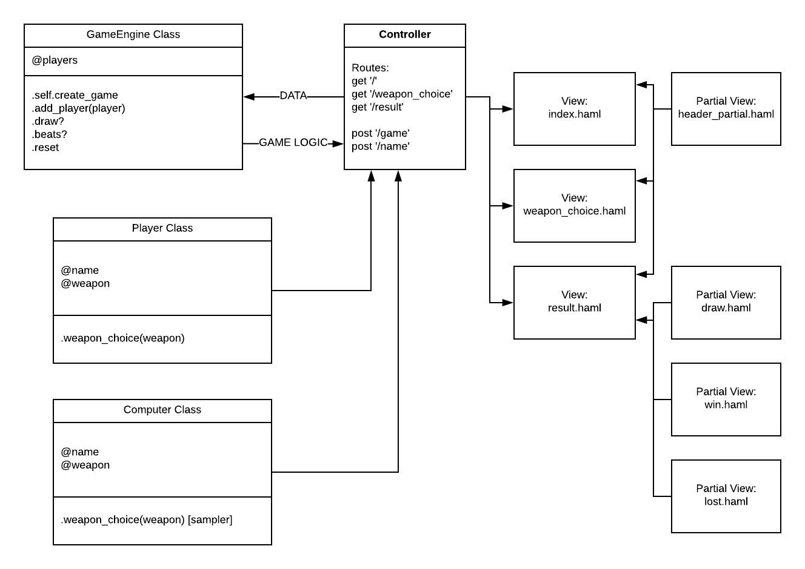

# RPS Challenge

Update
---
#### Approach to solving the challenge
**Creating the DOM model**

User Stories:

```
As a marketeer
So that I can see my name in lights
I would like to register my name before playing an online game
```

Object|Message|
:---:|:---:
User|
Game| register name

```
As a marketeer
So that I can enjoy myself away from the daily grind
I would like to be able to play rock/paper/scissors
```

Object|Message|
:---:|:---:
User|
Game| play game

Additional info, as provided was:

  - the marketeer should be able to enter their name before the start of the game
  - the marketeer will be presented the choices (rock, paper and scissors)
  - the marketeer can choose one option
  - the game will choose a random option
  - a winner will be declared
  
Object|Message|
:---:|:---:
User|
Game| .enter_name
-//-| .see_weapons
-//-| .choose_weapon
-//-| .game_ai_choose_weapon
-//-| .check_winner

The final program follows the following diagram:



#### Classes & methods

**GameEngine Class**

- Responsibility: Direct the Game
- Lives in: `lib/game_engine.rb`
- Spec lives in: `spec/game_engine_spec.rb`
- **NB:** _This class is created using a Singleton Pattern to ensure that there is only one of GameEngine instances running at all times._
- *GameEngine Class Methods*:

   - class methods:
   
      - `create_game` - eg `GameEngine.create_game` - used to create an instance of the game in the controller;
   - instance methods:
   
      - `players` - attribute reader to allow easy access to the players' array; 
      - `add_player(player)` - adds a player to the array of players that the game knows about (max of 2), will through an error otherwise;
      - `draw?` - checks if the players chose identical weapons, if so, returns `:draw` which drives the html output via haml insert (_see `app/views/result.haml`_), in the alternative calls `beats?` method to determine who won;
      - `beats?` - checks who won in accordance with the `RULES` table and returns `:win` or `:lose` which drives the html output via haml insert (_see `app/views/result.haml`_); and
      - `reset` - resets the array of players to an empty array at the start of each game.

**Player Class**

- Responsibility: Registers players with name and weapon choices
- Lives in: `lib/player.rb`
- Spec lives in: `spec/player_spec.rb`
- *Player Class Methods*:

   - `name` - an attribute reader to allow access to the player's name;
   - `weapon` - an attribute reader to allow access to the player's weapon choice; and
   - `weapon_choice(weapon)` - a method to register player's choice of weapon.

**Computer Class**

- Responsibility: Imitates human player, modeled on Player Class
- Lives in: `lib/computer.rb`
- Spec lives in: `spec/computer_spec.rb`
- *Computer Class Methods*:

   - `name` - an attribute reader to allow access to the computer's name;
   - `weapon` - an attribute reader to allow access to the computer's weapon choice; and
   - `weapon_choice(weapon)` - a method to pick computer's weapon at random.


#### Running tests

Run `rspec` from the project directory to run the entire suite.

Each class within the model layer (GameEngine, Player, Computer) is testing in isolation. Mocking is utilised in tests for the GameEngine class to imitate players and player choices.

##### Basic Usage

1. Clone the repo
2. Run `bundle install`
3. Run `rackup config.ru`
4. Point your browser to `localhost:9292`

Instructions
-------

* Challenge time: rest of the day and weekend, until Monday 9am
* Feel free to use google, your notes, books, etc. but work on your own
* If you refer to the solution of another coach or student, please put a link to that in your README
* If you have a partial solution, **still check in a partial solution**
* You must submit a pull request to this repo with your code by 9am Monday morning

Task
----

Knowing how to build web applications is getting us almost there as web developers!

The Makers Academy Marketing Array ( **MAMA** ) have asked us to provide a game for them. Their daily grind is pretty tough and they need time to steam a little.

Your task is to provide a _Rock, Paper, Scissors_ game for them so they can play on the web with the following user stories:

```sh
As a marketeer
So that I can see my name in lights
I would like to register my name before playing an online game

As a marketeer
So that I can enjoy myself away from the daily grind
I would like to be able to play rock/paper/scissors
```

Hints on functionality

- the marketeer should be able to enter their name before the game
- the marketeer will be presented the choices (rock, paper and scissors)
- the marketeer can choose one option
- the game will choose a random option
- a winner will be declared


As usual please start by

* Forking this repo
* TEST driving development of your app


## Bonus level 1: Multiplayer

Change the game so that two marketeers can play against each other ( _yes there are two of them_ ).

## Bonus level 2: Rock, Paper, Scissors, Spock, Lizard

Use the _special_ rules ( _you can find them here http://en.wikipedia.org/wiki/Rock-paper-scissors-lizard-Spock_ )

## Basic Rules

- Rock beats Scissors
- Scissors beats Paper
- Paper beats Rock

In code review we'll be hoping to see:

* All tests passing
* High [Test coverage](https://github.com/makersacademy/course/blob/master/pills/test_coverage.md) (>95% is good)
* The code is elegant: every class has a clear responsibility, methods are short etc.

Reviewers will potentially be using this [code review rubric](docs/review.md).  Referring to this rubric in advance may make the challenge somewhat easier.  You should be the judge of how much challenge you want this weekend.

Notes on test coverage
----------------------

Please ensure you have the following **AT THE TOP** of your spec_helper.rb in order to have test coverage stats generated
on your pull request:

```ruby
require 'simplecov'
require 'simplecov-console'

SimpleCov.formatter = SimpleCov::Formatter::MultiFormatter.new([
  SimpleCov::Formatter::Console,
  # Want a nice code coverage website? Uncomment this next line!
  # SimpleCov::Formatter::HTMLFormatter
])
SimpleCov.start
```

You can see your test coverage when you run your tests. If you want this in a graphical form, uncomment the `HTMLFormatter` line and see what happens!
