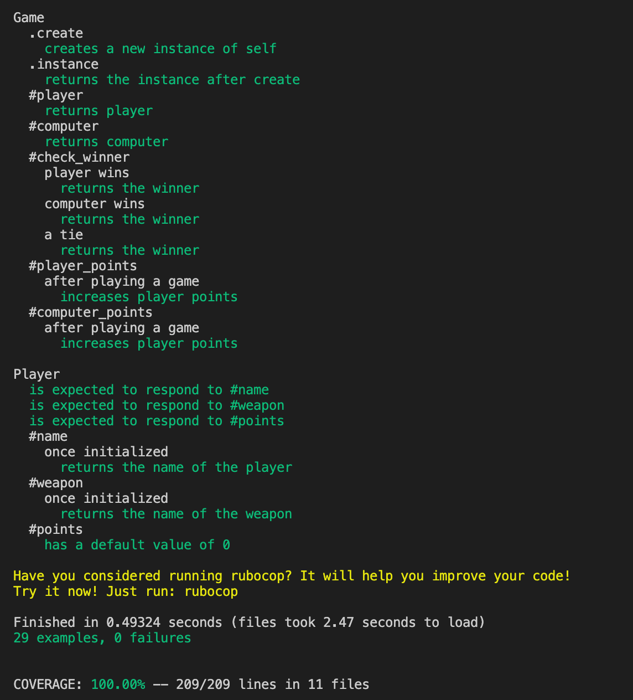

# Rock, Paper, Scissors with Web Framework

[](https://travis-ci.com/jasonrowsell/rps-challenge) [](https://codeclimate.com/github/jasonrowsell/rps-challenge/maintainability) [](https://bettercodehub.com/)

[Check it our here.](https://jasonrowsell-rps-sinatra.herokuapp.com/)

## Table of Contents

- [Overview](#overview)
- [Getting Started](#getting-started)
  - [Development](#development)
  - [Usage](#usage)
- [Spec](#spec)
  - [Brief](#brief)
  - [Requirements](#requirements)
- [Design](#design)
  - [Testing](#testing)
  - [Test Coverage](#test-coverage)
  - [Technologies Used](#technologies-used)
- [Planning](#planning)
  - [User Stories](#user-stories)

<!-- Overview -->

## Overview

A simple game of Rock, Paper, Scissors played against an AI opponent. The web app allows the user to sign-in, choose a weapon, and play a game of Rock, Paper, Scissors.

## Getting Started

### Local Development

Clone this repo.
To install dependencies:

```shell
bundle
```

Run test suites with:

```shell
rspec
```

Start the server to run locally:

```
rackup
```

Navigate to [localhost:9292](http://127.0.0.1:9292) in your browser.

### Usage

[Contents](#table-of-contents)

---

## Spec

### Brief

##### Instructions

- Feel free to use google, your notes, books, etc. but work on your own
- If you refer to the solution of another coach or student, please put a link to that in your README
- If you have a partial solution, **still check in a partial solution**
- You must submit a pull request to this repo with your code by 9am Monday morning

##### Task

Knowing how to build web applications is getting us almost there as web developers!

The Makers Academy Marketing Array ( **MAMA** ) have asked us to provide a game for them. Their daily grind is pretty tough and they need time to steam a little.

Your task is to provide a _Rock, Paper, Scissors_ game for them so they can play on the web with the following user stories:

```
As a marketeer
So that I can see my name in lights
I would like to register my name before playing an online game

As a marketeer
So that I can enjoy myself away from the daily grind
I would like to be able to play rock/paper/scissors
```

Hints on functionality

- the marketeer should be able to enter their name before the game
- the marketeer will be presented the choices (rock, paper and scissors)
- the marketeer can choose one option
- the game will choose a random option
- a winner will be declared

As usual please start by

- Forking this repo
- TEST driving development of your app

##### Bonus level 1: Multiplayer

Change the game so that two marketeers can play against each other ( _yes there are two of them_ ).

##### Bonus level 2: Rock, Paper, Scissors, Spock, Lizard

Use the _special_ rules ( _you can find them here http://en.wikipedia.org/wiki/Rock-paper-scissors-lizard-Spock_ )

### Requirements

##### Basic Rules

- Rock beats Scissors
- Scissors beats Paper
- Paper beats Rock

In code review we'll be hoping to see:

- All tests passing
- High [Test coverage](https://github.com/makersacademy/course/blob/master/pills/test_coverage.md) (>95% is good)
- The code is elegant: every class has a clear responsibility, methods are short etc.

Reviewers will potentially be using this [code review rubric](docs/review.md). Referring to this rubric in advance may make the challenge somewhat easier. You should be the judge of how much challenge you want this at this moment.

##### Notes on test coverage

Please ensure you have the following **AT THE TOP** of your spec_helper.rb in order to have test coverage stats generated
on your pull request:

```ruby
require 'simplecov'
require 'simplecov-console'

SimpleCov.formatter = SimpleCov::Formatter::MultiFormatter.new([
  SimpleCov::Formatter::Console,
  # Want a nice code coverage website? Uncomment this next line!
  # SimpleCov::Formatter::HTMLFormatter
])
SimpleCov.start
```

You can see your test coverage when you run your tests. If you want this in a graphical form, uncomment the `HTMLFormatter` line and see what happens!

[Contents](#table-of-contents)

---

## Play

https://jasonrowsell-rps-sinatra.herokuapp.com/

## Screenshots


## Features

- User can sign-up using their name/username
- User can choose a weapon to play the game with
- User plays against an AI opponent featuring an animation
- User is prompted to play again and choose a different weapon
- User can track the running score during the game

[Contents](#table-of-contents)

---

## Design

### Testing

Extensive testing and error checking was undertaken throughout the development process. I have broken the specs into unit and feature test suites to make it easier to navigate the tests.

- [Test Coverage: 100%](#test-coverage), SimpleCov
- Testing covers and passes acceptance criteria
- Prominence on BDD (Behaviour Driven Development)
- Automated feature testing
- Unit tests in isolation
- Red Green Refactor loop

### Test Coverage



### Technologies Used

I used the following technologies to create Rosstagram:

- [Sinatra](http://sinatrarb.com/)
  - Used as the main framework for the application.
- [HTML5](https://developer.mozilla.org/en-US/docs/Web/Guide/HTML/HTML5)
  - Used as the main language for the templates
- [CSS3](https://developer.mozilla.org/en-US/docs/Archive/CSS3)
  - Used for the overall look of the site and player animations.
- [Javascript](https://developer.mozilla.org/en-US/docs/Web/JavaScript)
  - Used to aid site functionality.
- [JQuery](https://jquery.com)
  - Used to simplify DOM manipulation.
- [Git](https://git-scm.com/)
  - Used for version control.
- [Heroku](https://www.heroku.com/)
  - Used to host the web app.
- [RSpec](https://rspec.inof/)
  - Used for automated testing.
- [Capybara](https://github.com/teamcapybara/capybara/)
  - Used for functional tests that simulate how users would interact with the application.
- [Selenium WebDriver](https://www.selenium.dev/)
  - Used to automate web-based application testing to verify that it performs expectedly.
- [Google fonts](https://fonts.google.com/)
  - Used for website fonts.

<div align="center">

---

[Top](#table-of-contents)

---

</div>
