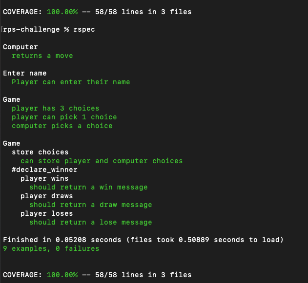

# Rock, Paper, Scissors (RPS)

The purpose of this project was to design a simple web app using Ruby, Sinatra & Capybara. The app allows the user to play a game of rock, paper scissors with a computer opponent. 

## Getting started

Clone the repo to your computer with the following command:

`git clone https://github.com/ArifEbrahim/rps-challenge.git`

Navigate to the new directory and run bundler from the command line to install dependencies 

`bundle`

## Usage

To use the application, run the following command in the command line:

`rackup`

Navigate to `http://localhost:9292/` in your browser of choice and follow the on-screen instructions

## Running tests

All tests were performed in RSpec, to run the tests navigate to the root folder in the command line and run:

`rspec`

The output of the tests can be seen below:

## Future work

The following are modifications that could have been implemented with more time:
- Upgrade the game to include Lizard and Spock options
- Improve the (currently very basic) user interface 

Original README [here]