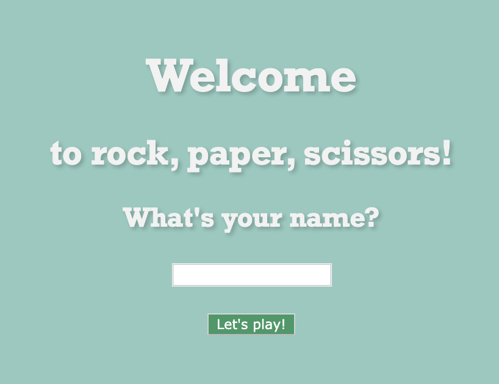
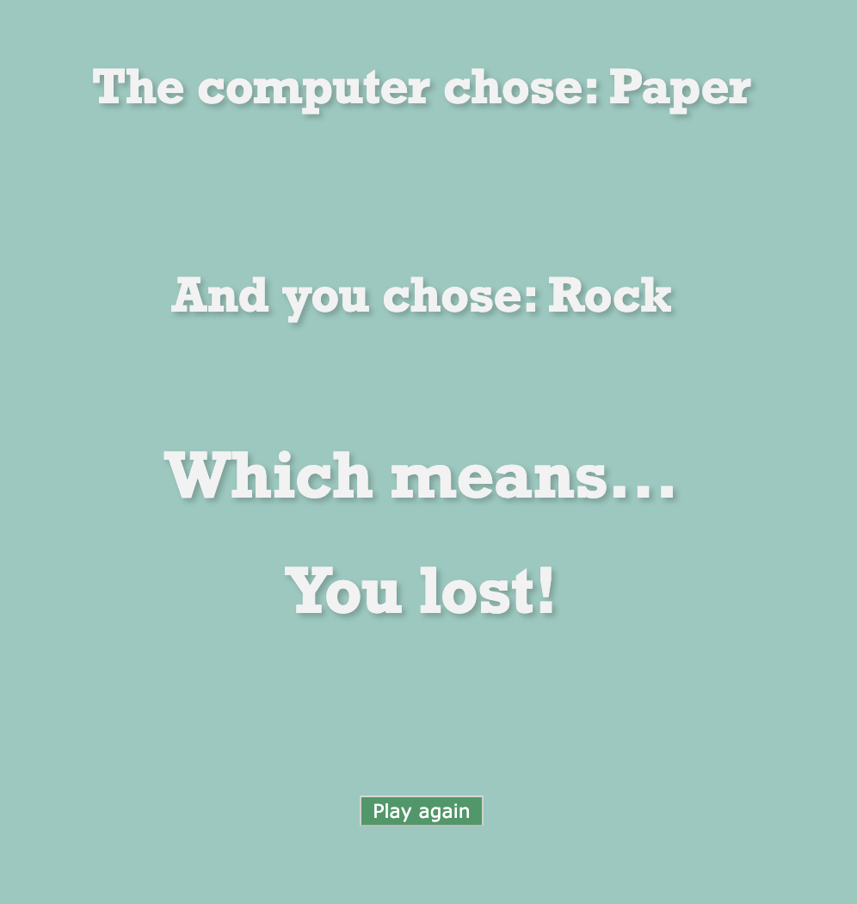

# RPS Challenge
This challenge involved meeting the user stories below and implementing the web app game in our own interpretation.
<br>
<p align="center">

<br><br>
  The welcome homepage, which prompts the user for their name.
</p>
<br>
<p align="center">

<br><br>
  The landing page asking for a move.
</p>
<br>
<p align="center">

<br><br>
  The final decision page that determines whether the user has won or lost.
</p>

User Stories
----

```
As a marketeer
So that I can see my name in lights
I would like to register my name before playing an online game

As a marketeer
So that I can enjoy myself away from the daily grind
I would like to be able to play rock/paper/scissors
```

## The usual basic rules of RPS:

- Rock beats Scissors
- Scissors beats Paper
- Paper beats Rock

## Criteria to be met:
✅ All RSPEC and Capybara tests passing.\
✅ High [Test coverage](https://github.com/makersacademy/course/blob/master/pills/test_coverage.md) (>95% is good)\
✅ The code is elegant: every class has a clear responsibility, methods are short etc.

## Skills used:
- RSpec testing
- Capybara testing
- Class interaction
- Basic styling


## Shortcomings:
- The RSpec tests are patchy and should be more thorough.
- The styling format should be neater within the erb files.

