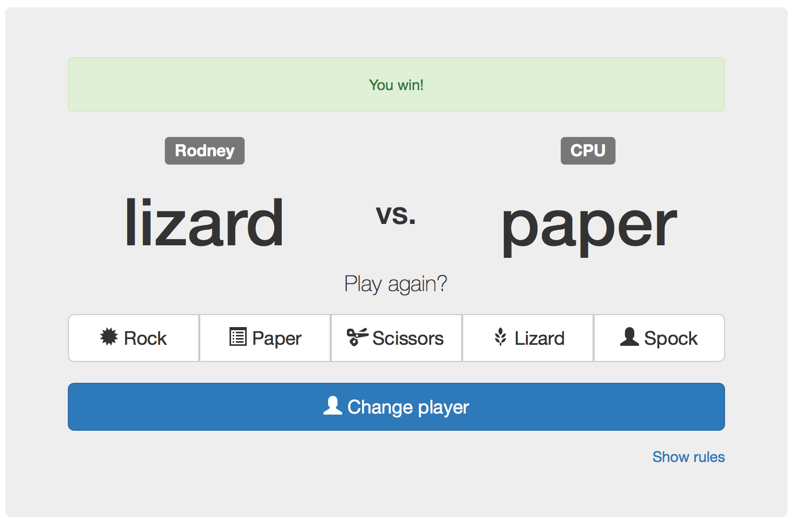

# Rock, Paper, Scissors Game
---

It is a zero-sum hand game usually played between two people, in which each player simultaneously forms one of three shapes with an outstretched hand.

These shapes are "rock" (a simple fist), "paper" (a flat hand), and "scissors" (a fist with the index and middle fingers together forming a V).

The game has only three possible outcomes other than a tie:
- Rock beats Scissors
- Scissors beats Paper
- Paper beats Rock



<!--  -->

## Heroku
[RPS game](https://rps-game-k.herokuapp.com/play)

## Download and Run
After cloning the project, enter the following lines on the command-line:
```
$ bundle
$ rackup
```
## Tests
```
$ rspec
```

----
###### Images copyright: [Osman Ince](http://osmanince.dribbble.com)
