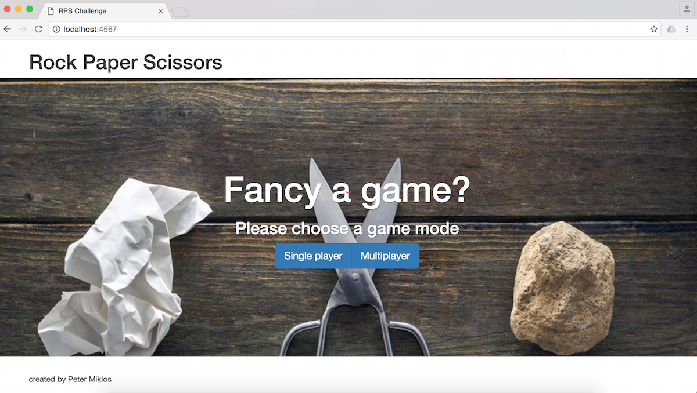

[](https://travis-ci.org/makersacademy/rps-challenge)
[](https://camo.githubusercontent.com/7232f69a10a0bc5595b44af950411307b2e69339/68747470733a2f2f636f766572616c6c732e696f2f6275696c64732f373733393832382f6261646765)

RPS Challenge
==================

Description
-------
The Makers Academy Marketing Array ( **MAMA** ) have asked us to provide a game for them. Their daily grind is pretty tough and they need time to steam a little. The task was to provide a Rock, Paper, Scissors (RPS) game for them. The program covers the following user stories:

```
As a marketeer
So that I can see my name in lights
I would like to register my name before playing an online game

As a marketeer
So that I can enjoy myself away from the daily grind
I would like to be able to play rock/paper/scissors
```
The program provides the following functions:
- the user can play in Single player or multiplayer mode. In Single player mode, the marketeer plays with the computer
- after registering name(s), the user(s) can see the possible choices (rock, paper, scissors, Spock and lizard) and choose from them
- if user play with the computer, it randomly chooses one from the above options
- a winner always declared, except the case when the same options are chosen
- user(s) can see the number of won games
- at the end of the game, player(s) can choose to either continue playing in the same mode or start a new game

### Screenshots of main functions
#### Start screen




### Instructions for how to run the app

```
$ git clone git@github.com:peter-miklos/rps-challenge.git
$ cd rps-challenge
$ bundle
$ ruby rps.rb
```

Tests
-------
### Feature tests
In feature tests the following test cases have been used:
```
Computer
  #choice
    returns a random value of the rps array
  #add_win
    add 1 to the number of won games
    returns itself

Game
  #self.create
    creates a new instance of the Game class
  #self.instance
    returns the saved Game instance
  #player_1
    returns player1
  #player2
    returns player2
  #turn_won
    reduces the lives of the player by calling a player method
  #play_game
    returns player with rock, if the other player is with scissors
    returns player with scissors, if the other player is with paper
    returns player with paper if the other player is with rock
    returns 'draw' if players' choices are the same
  #add_player1_choice
    store the choice of player 1

Player
  #name
    returns the name of the player
  #add_win
    add 1 to the number of won games
    returns itself
  #wins
    returns the remaining lives of the player
```

### Unit tests
The following test cases pass the unit test:
```
Choose the game mode
  choose single player mode
  choose multiplayer mode

Enter name
  submitting name in single player mode
  submitting names in multiplayer mode

Show game result
  player 1's choice is visible
  computer's choice is visible
  player 2's choice is visible
  player can play again or new game with new player(s) can be started
  players can play again or new game with new player(s) can be started

Calculate result
  in single player mode
    declares the player as the winner
    declares the computer as the winner
    declares the draw if choices are the same
  in multiplayer mode
    declares the player1 as the winner
    declares the player2 as the winner
    declares the draw if choices are the same

Show the number of wins of both players
  number of won games are 0 at game start
  1 is added to player's number of won games
  1 is added to computer's number of won games
```
