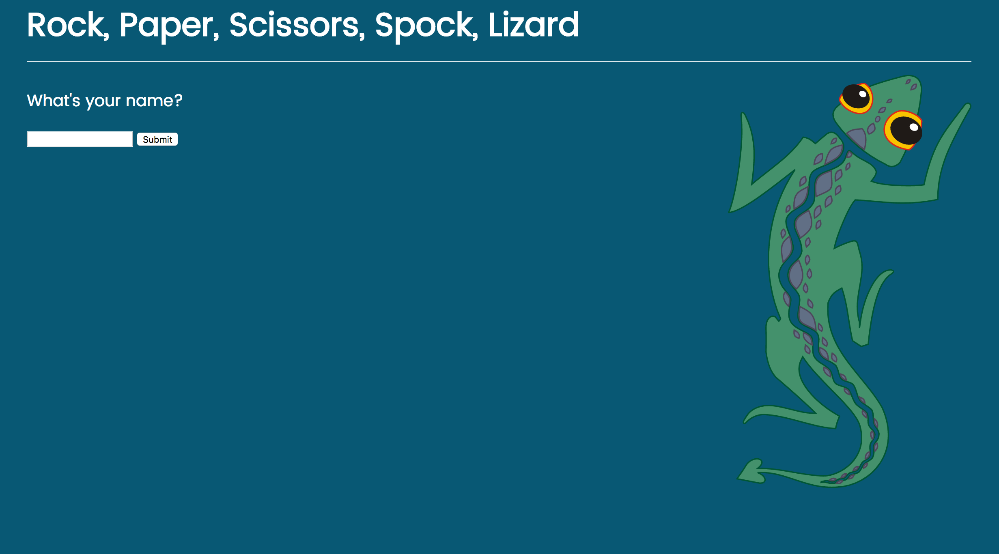
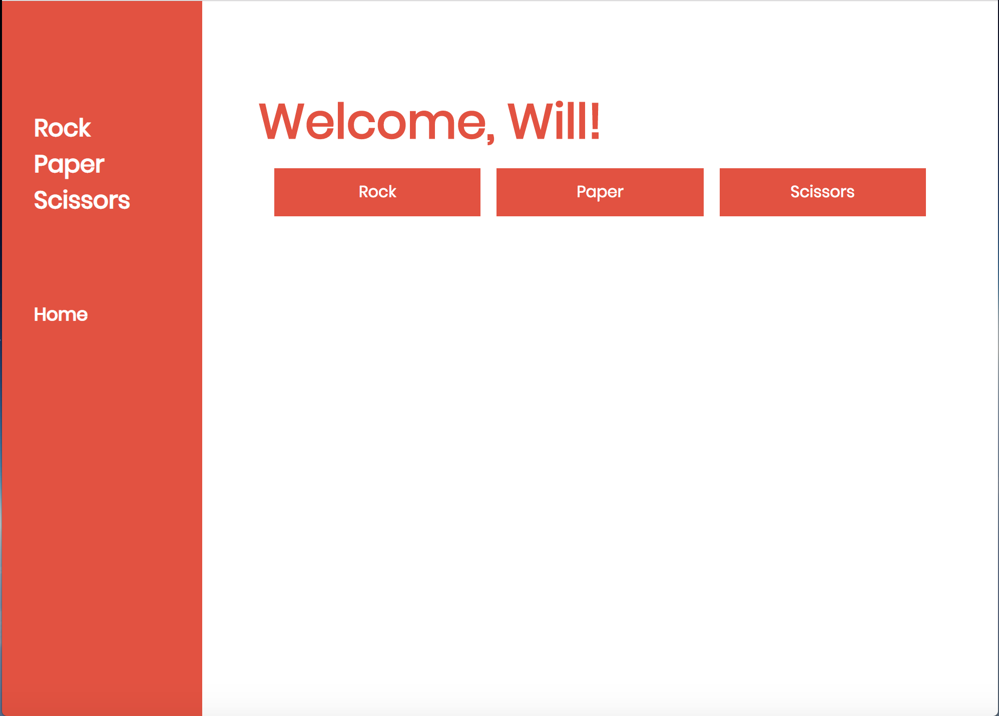
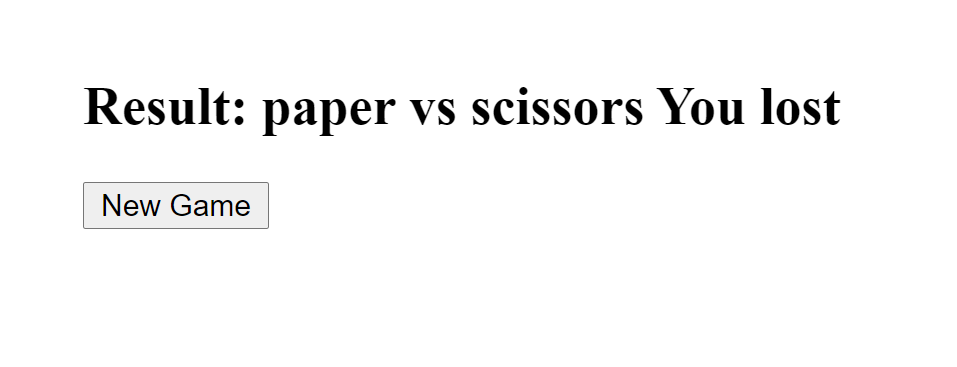

# Brief


I have been asked to design and build a web application for the Makers Academy Marketing Team which will allow them to play a game of 'Paper, Rock, Scissors, Spock, Lizard'.  

The 'special rules' applicable to 'Paper, Rock, Scissors, Spock, Lizard' which are available here http://en.wikipedia.org/wiki/Rock-paper-scissors-lizard-Spock

## User Stories

```
As a marketeer
So that I can see my name in lights
I would like to register my name before playing an online game

As a marketeer
So that I can enjoy myself away from the daily grind
I would like to be able to play rock/paper/scissors
```

## Technology

I have produced the application using Ruby (version 2.3.3) with the Sinatra web application library.  I have tested the application using both Rspec and Capybara.  In order to run the tests, please enter the following command, '$ rspec'.


## Installation

* Fork/clone this repository

* $ bundle install

* $ ruby app.rb

* In your browser, visit http://localhost:4567/

## Playing the Game

Upon visiting http://localhost:4567/, the user is asked to enter his/her name.



The user is then asked to make their selection from the available options.



The user is then told the computer's selection and whether they have won or lost the game.  Finally, the user is provided with the option of playing the game again.




## References

In making the game, I included the following image from http://openclipart.org:

  - Lizard: https://openclipart.org/download/21111/buggi-lizard.svg

## Future functionality

In the future, I would like to add functionality for two human players as well as further improving the style of the application using additional CSS.
