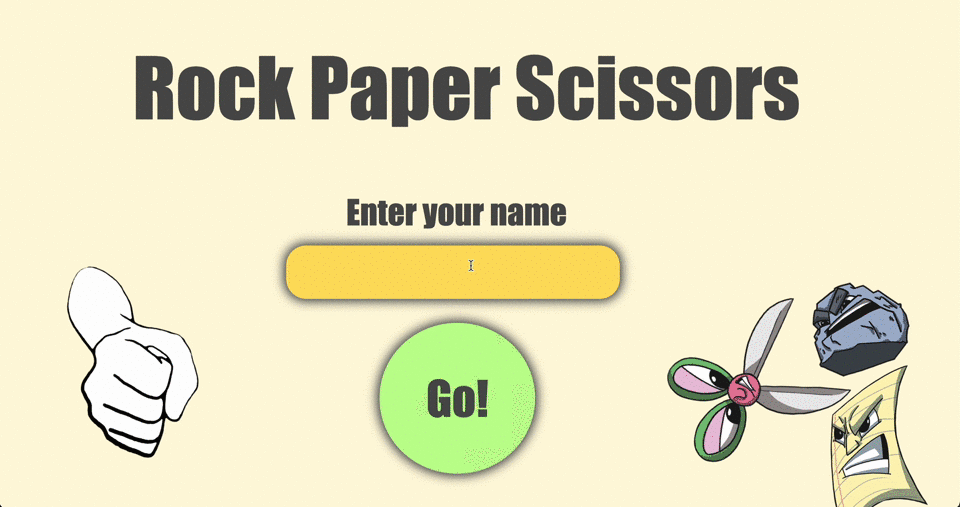
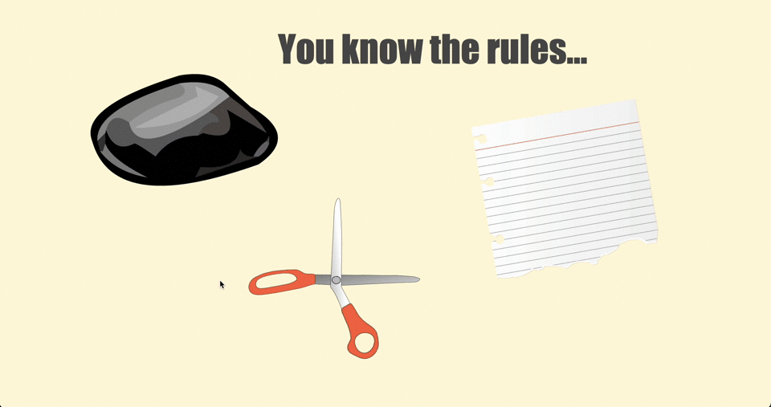

# Rock Paper Scissors 🪨  📄  ✂️

[](https://travis-ci.com/AJ8GH/rps-challenge) [](https://coveralls.io/github/AJ8GH/rps-challenge?branch=master) [](https://codeclimate.com/github/AJ8GH/rps-challenge/maintainability)

### *Are the stresses of marketeering are getting you down? Unwind with some soothing RPS*

### *No friends? No problem! Play against a sophisticated AI opponent*

## Dependencies
- `ruby version`
- `gems`
- `capybara`
- `coveralls_reborn (~> 0.20.0)`
- `rspec`
- `rubocop (= 0.79.0)`
- `shotgun`
- `simplecov`
- `simplecov`-console
- `sinatra`

## Getting started

Clone

```
git clone git@github.com:AJ8GH/rps-challenge
```

cd into root folder

```
cd rps-challenge
```

Install dependencies

```
bundle
```

Start the server

```
rackup
```

In your browser, head to [localhost:9292](http://localhost:9292)

## using the app


### Enter your name



### Click play and make your move!



### Play again as many times as you like!


## reflections

In building the app, my main focuses were:
- Applying a strict red green refactor TDD approach
- Feature testing and unit testing to achieve comprehensive test coverage
- Use of MVC principles to achieve skinny controllers and views, with logic extracted to the model
- Using class instance variable to store my game's and players' state, and before filters, to elegantly pass objects between routes in the controller
- Applying the OOD principles from weeks 1 and 2

With unlimited time, there's a few things I would do to extend the application:
- Create an optional 2 player mode which players can select at the start of the game
- Upgrade the game to Rock Paper Scissors Lizard Spock
- Create a score counter to keep track of the score
- I may implement these features in the coming weeks if I have time!

Key takeaways
- Understanding and applying MVC correctly feels like an important factor in successfully building an extendable web app
- CSS can be a slow process (at least when you're new to it!) But it's a great feeling when it all comes together
- It's been a week of building web apps and even though they've been fairly basic so far, it feels like great progress in 7 days
- Looking forward to learning how to build more sophisticated and impressive web apps! Bring on week 4


