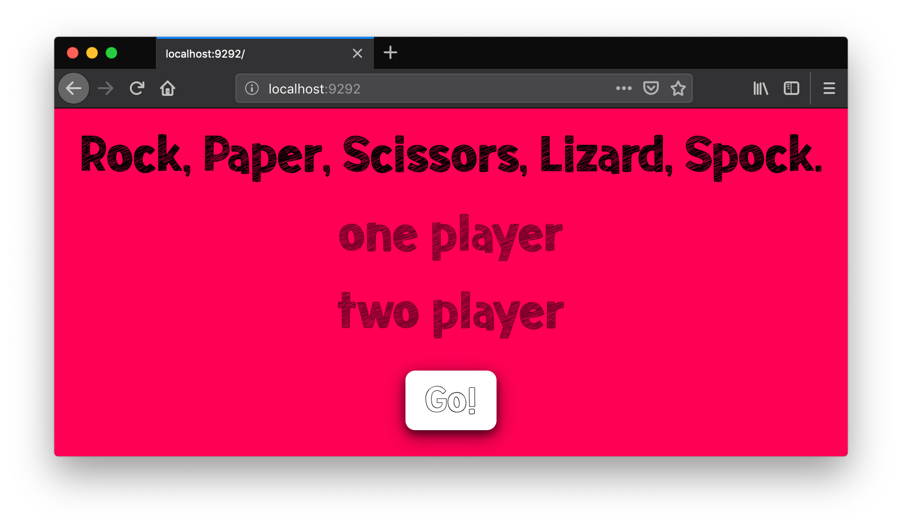
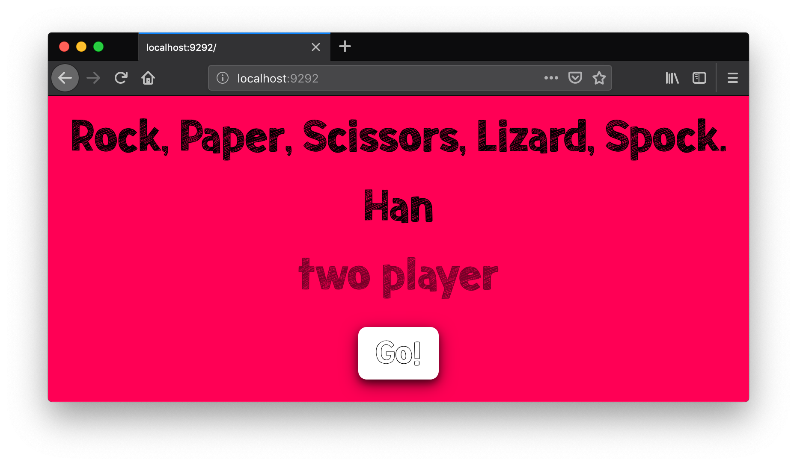
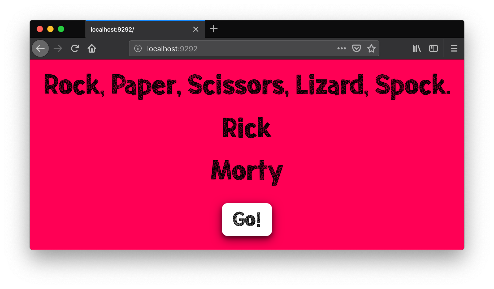
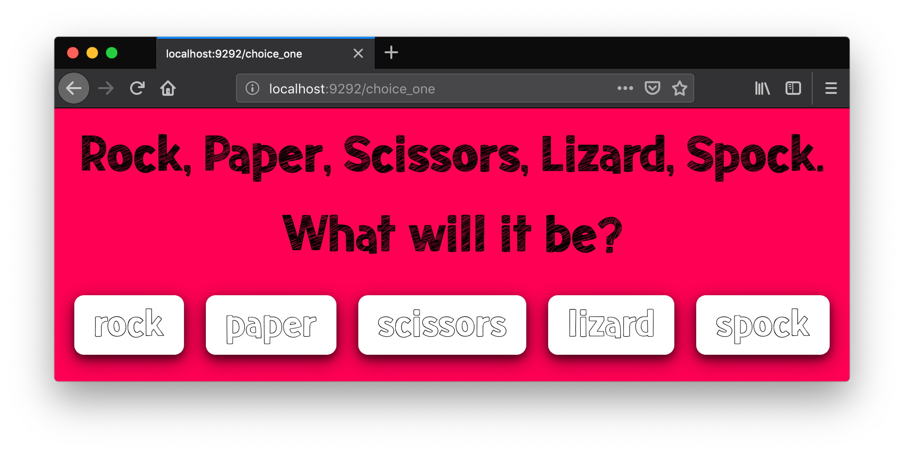
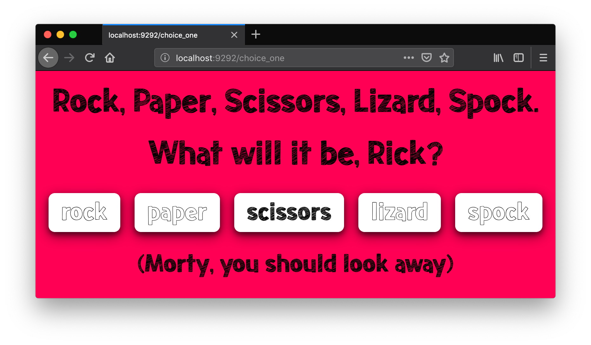
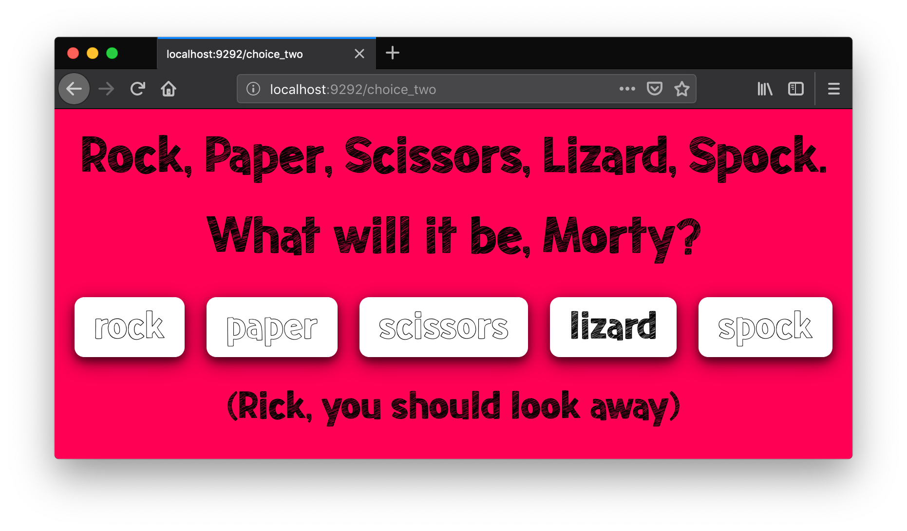
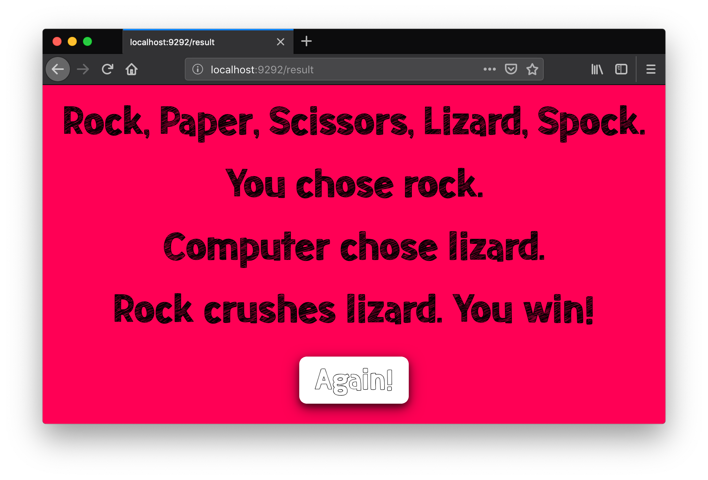
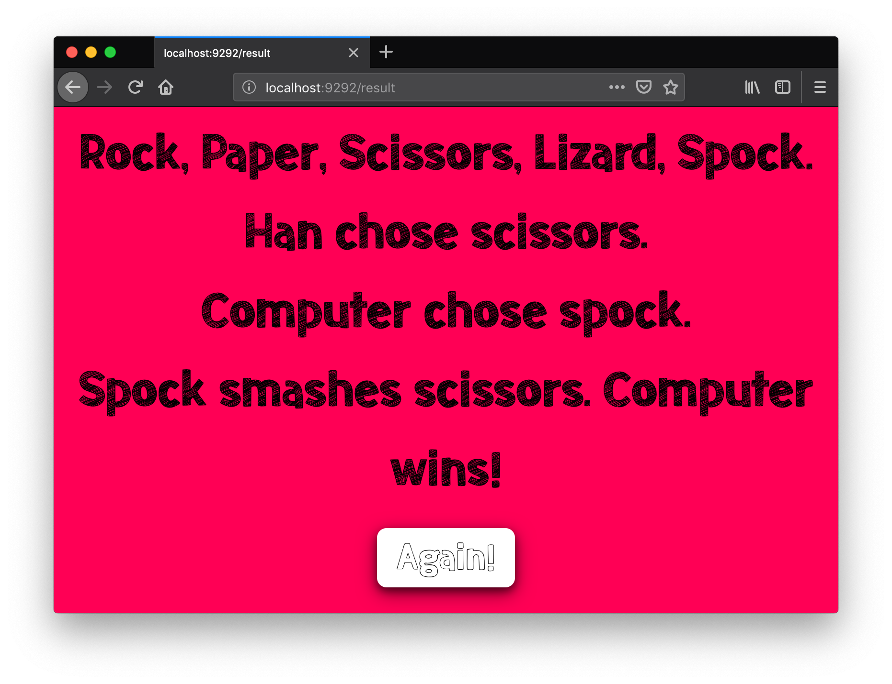
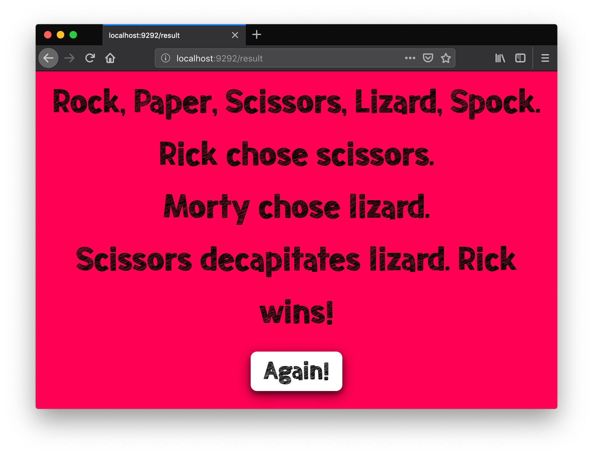

# Rock, Paper, Scissors, Lizard, Spock.

Makers Week 3 (Friday) - This project is a game for one or two players to play rock, paper, scissors, extended to include lizard, and spock.

## Getting started

In the location of your choice, in Terminal:

`git@github.com:alittlecross/rps-challenge.git`

In that same location, in Terminal:

`bundle`

## Usage

In that same location, in Terminal:

`rackup`

Then in the browser of your choice:

`http://localhost:9292/`

Players should see the page to enter names:

The player can enter one name (or no name) to play a one player game:

Entering two names to play a two player game:

Enter no name and the game will address the player accordingly:

Similarly, if the player enters one name:

If the player enters two names the game will ask the second player to look away when player one chooses a weapon:

And the opposite when player two chooses a weapon:

The game will refer to the player as 'you' if no name was entered at the start:

And player two as 'computer' if playing a one player game:

The game will show what each player chose and who wins:

With the option of playing again. If a one player game was started then a one player game will continue, likewise for a two player game.

## Running tests

In that same location, in Terminal:

`rspec`

## Linting

In that same location, in Terminal:

`rubocop`
