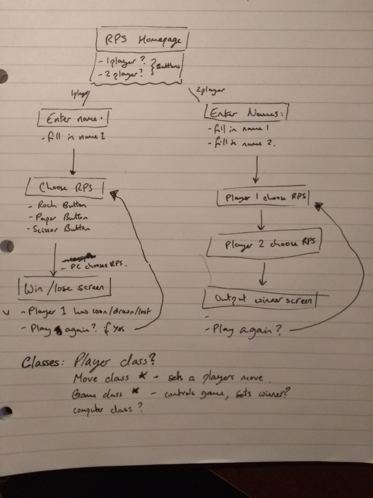

# RPS Challenge

This repo contains the homework challenge from week 3 at Makers Academy. The challenge was to create a website that lets you player rock paper scissors either in single player or multi-player and this has been completed using Sinatra to host the server for the games and Ruby to run all of the logic behind who wins and loses.


## How to use

To use this repo to create a game on your local server:
1. clone it
2. on the command line, navigate to the directory it's saved in
3. run ```bundle```
4. run the command ```rackup```
5. open your favourite browser and head to localhost:9292

## Behind the scenes

I started off creating the framework of the actual website before writing objects that would control the game. By drawing out a simple outline of how I wanted the website to work as shown below I had it clear in my head whilst building it.



Then once the website was built I created the models for how I wanted a game of RPS to run and linked the two together.

## Plans for the future of this project

- update it with a counter to track how many wins and losses each player has
- rock paper scissors lizard spock - found some nice examples on how to run this game without having a million if and elsif statements
- in general make it look a bit more fancy. it has a simplistic but nice look at the moment but an amazing thing would be adding graphics of scissor cutting paper, rock crushing scissors etc.
