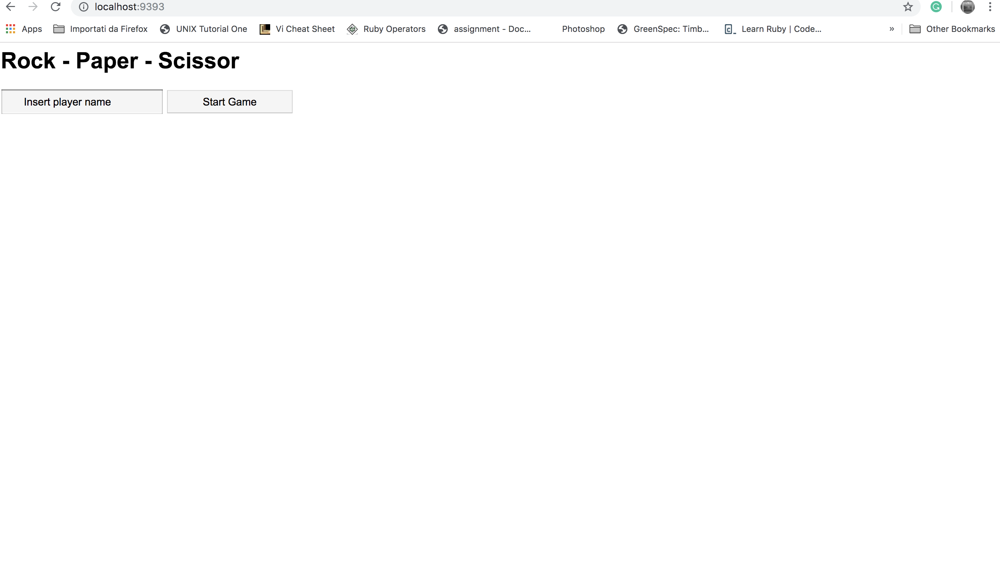
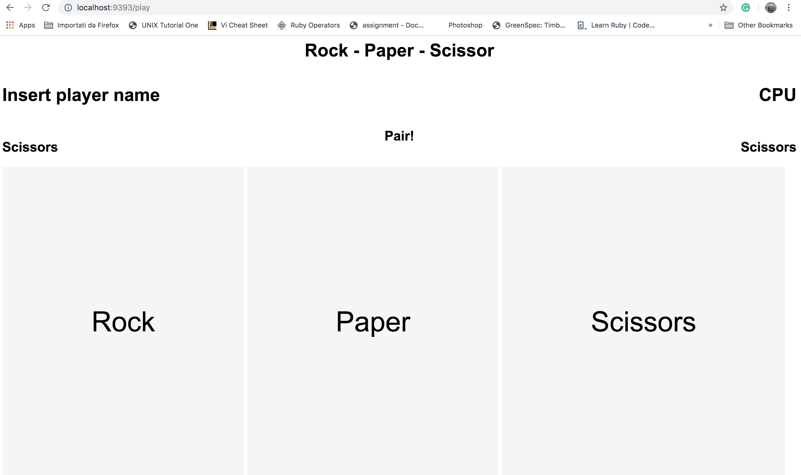
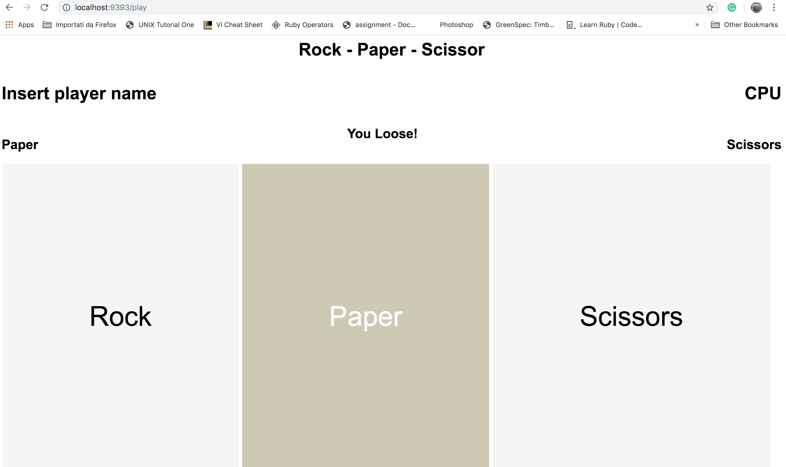

# ROCK - PAPER - SCISSORS

This is a web app to play the famous hand game RPS on the web!

## Domain model

Player  --> Enter the domain URL  --> Page
Page -->  shows -->  Game title, name box, submit button
Player  -->  Enter -->  name
Page -->  shows --> Game title, player name, rock paper scissors buttons 
Player  -->  Click -->  Rock button
Page  -->  Shows  -->  CPU random choice and winner

## Getting started

* Please clone the repository typing on your terminal: `git@github.com:l-palermo/rps-challenge.git`
* Then run `bundle` to install dependecies

## How to use the software

* From the folder `RPS-CHALLENGHE` run:

`$ rackup` (check what port the server is listening to)
* Move to the browser and in the URL line type:

`http://localhost:"#portnumber"/`
* if show a message error `Address already in use` type: 
`rackup -p 9393` (-p specifies the port number)
* To run tests:
`$ rspec`

### Example of usage

