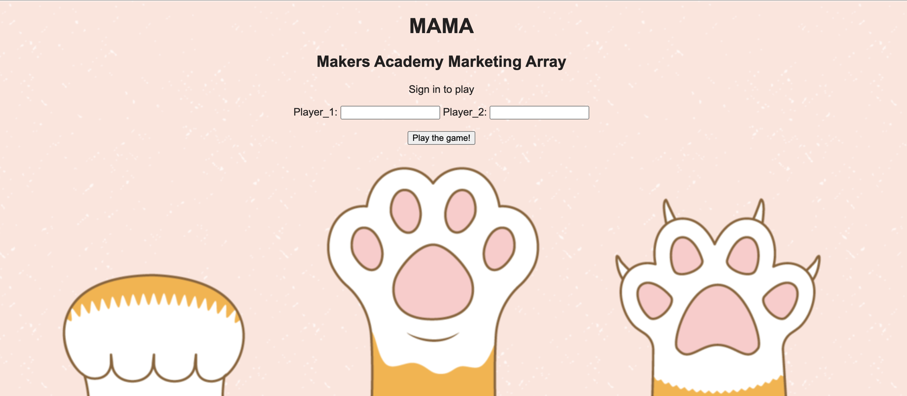
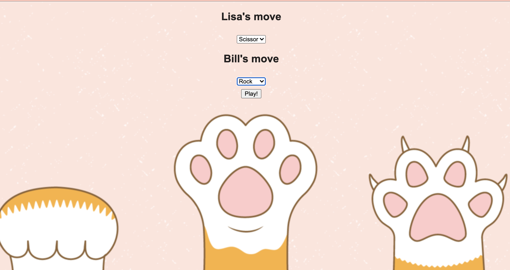
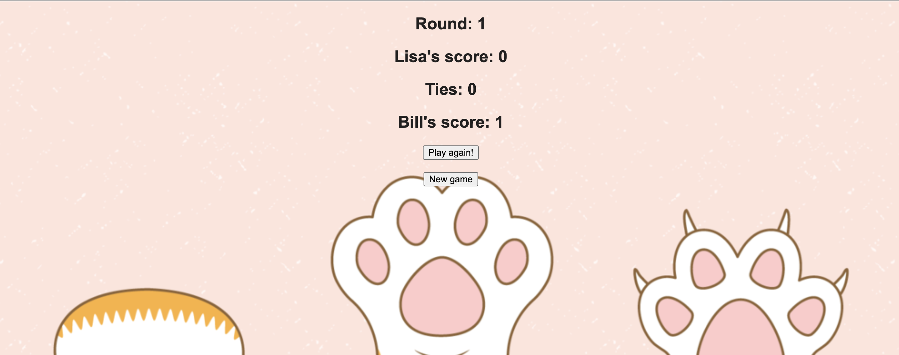

# RPS Challenge


Build a Rock Paper Scissors game using Sinatra and MVC model.

## User stories

```
As a marketeer
So that I can see my name in lights
I would like to register my name before playing an online game

As a marketeer
So that I can enjoy myself away from the daily grind
I would like to be able to play rock/paper/scissors
```


## How to run

```
git clone https://github.com/lisabardelli/rps-challenge.git

cd rps-challenge

ruby app.rb
```
Then visit http://localhost:4567/


## **Home**


## **Play the game**


## **Score**


## **Final score**

