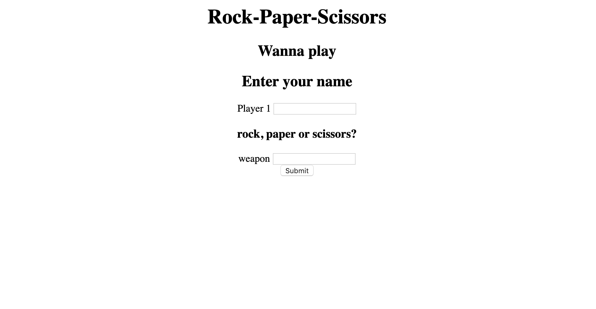
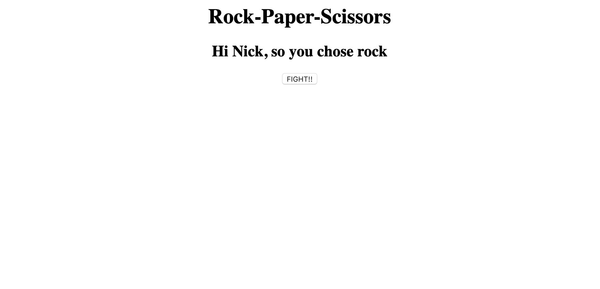
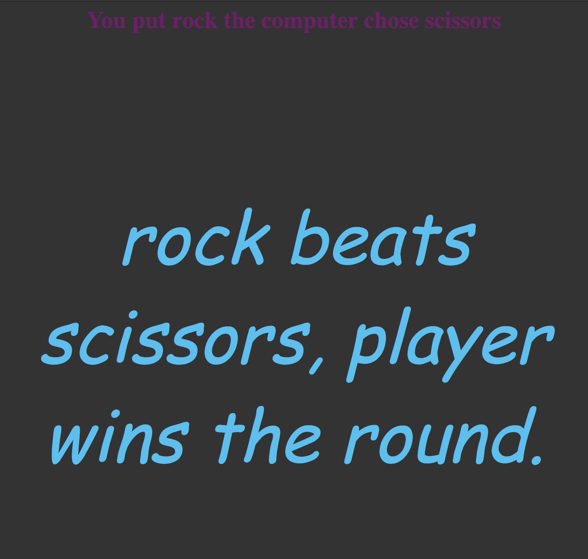
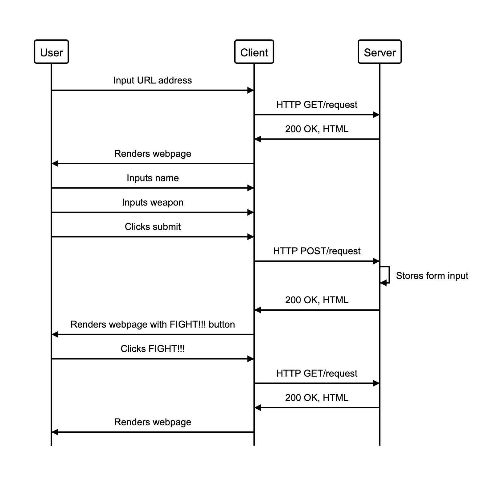
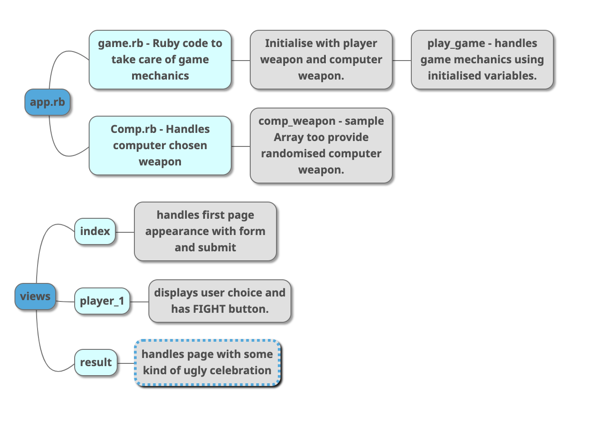

**Rock, Paper, Scissors**

The Makers Academy Marketing Array ( **MAMA** ) have asked us to provide a game for them. Their daily grind is pretty tough and they need time to steam a little.

Your task is to provide a _Rock, Paper, Scissors_ game for them so they can play on the web with the following user stories:

```
As a marketeer
So that I can see my name in lights
I would like to register my name before playing an online game

As a marketeer
So that I can enjoy myself away from the daily grind
I would like to be able to play rock/paper/scissors
```
<br>
<p align="center">

<br><br>
  Top Page.
</p>
<br>
<br>
<p align="center">

<br><br>
  Returns players choice and FIGHT button.
</p>
<br>
<p align="center">

<br><br>
  The final page, in this case showing a victory!.
</p>

**Sequence Diagram**

</p>
<br>
<p align="center">

<br><br>
</p>

**Domain model**

</p>
<br>
<p align="center">

<br><br>
</p>
