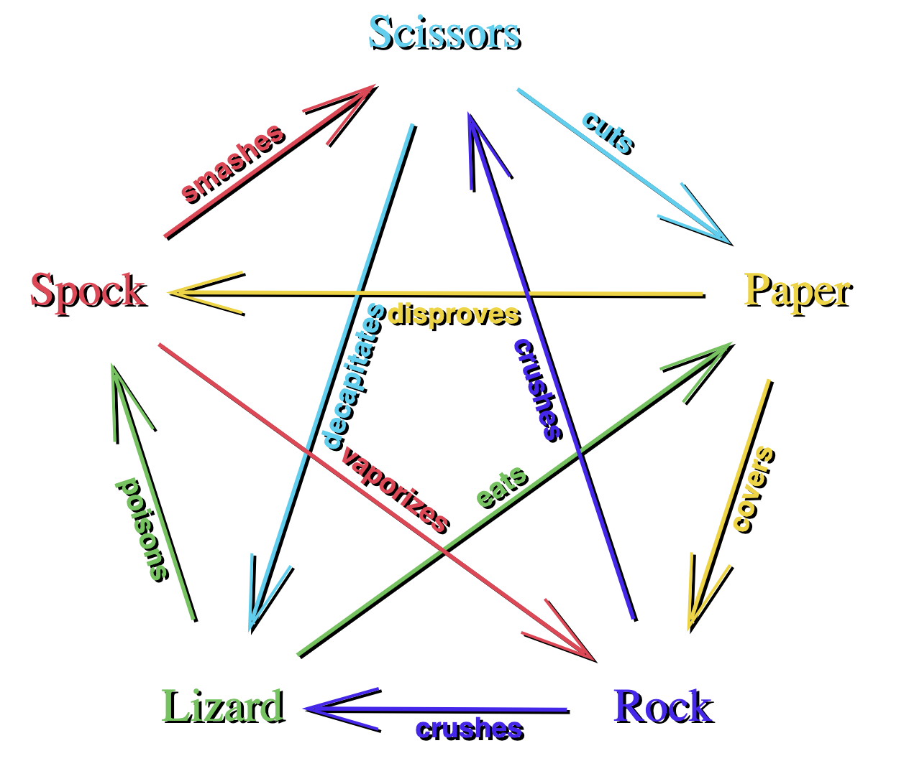

### [Makers Academy](http://www.makersacademy.com) - Week 3 Weekend Project 

# RPS Challenge ✊✋✌️
[Task](#Task) | [Installation Instructions](#Installation) | [Functional Description](#Functional_Description) | [User Stories](#User_Stories) | [Objects & Methods](#Methods) | [Testing](#Testing) | [Further improvements](#Further_Improvements) |


## <a name="Task">The Task</a>

The Makers Academy Marketing Array ( **MAMA** ) have asked us to provide a game for them. Their daily grind is pretty tough and they need time to steam a little. Your task is to provide a _Rock, Paper, Scissors_ game for them so they can play on the web with the below user stories.

This challenge is the third weeked challenge at [Makers Academy](https://github.com/makersacademy).

## <a name="Installation">Installation Instructions</a>

1. Fork this repository, clone to your local machine then change into the directory:
```
$ git clone git@github.com:davmcgregor/rps-challenge.git
$ cd rps-challenge
```
2. Load dependencies with bundle:
```
$ gem install bundle
$ bundle
```
3. Run Rspec for tests and coverage, then rubocop for linting
```
$ rspec
$ rubocop
```
4. Run the app on a local server and play on the broswer: http://localhost:4567/

```Shell
$ rackup config.ru -p 4567
```

## <a name="Functional_Description">Functional Description</a>

As part of the system's functionality:

* The marketeer can enter their name before the game
* The marketeer is presented the choices (rock, paper and scissors)
* The marketeer can choose one option
* The game chooses a random option
* A winner is declared

### Basic Rules



## <a name="User_Stories">User Stories</a>
```
As a marketeer
So that I can see my name in lights
I would like to register my name before playing an online game
```
```
As a marketeer
So that I can enjoy myself away from the daily grind
I would like to be able to play rock/paper/scissors
```
## <a name="Methods">Objects & Methods</a>

For the user stories I created a domain model for each object, including attributes and behaviour:

### Game

| Methods | Description |
| --- | --- |
| self.create(player_1, player_2) | Class method that creates a game with two players |
| .self.instance | Class method that returns the game class instance variable |
| initialize(player_1, player_2) | | initialize(name) |  Sets name instance vairbles taken as two arguments, and score instance variables set to 0 | 
| outcome | Returns a win, loss or draw depending on player_1 and player_2 choice. Increments a score if a win result |

### Player

| Methods | Description |
| --- | --- |
| initialize(name) |  Sets name and score instance variables name with argument and choice as an empty string | 
| set_choice(choice) |  Sets the choice variable using argument | 
| show_choice |  Returns the choice variable | 

## <a name="Testing">Testing</a>

Tests were written with RSpec and Capybara. To run the tests in terminal: 

```bash
$ cd rps-challenge
$ rspec
```
## <a name="Further_Improvements">Further Improvements</a>

* Add styling
* Continue to refactor
* Add a score tally

