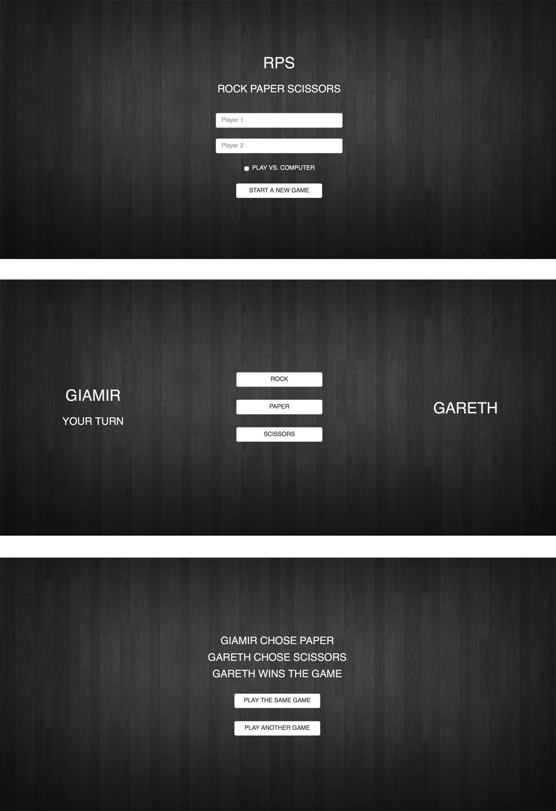

### [Makers Academy](http://www.makersacademy.com) - Week 3 Weekend Project 

# RPS Challenge ✊✋✌️
[Task](#Task) | [Installation Instructions](#Installation) | [Functional Description](#Functional_Description) | [Feature Tests](#Feature_Tests) | [User Stories](#Story) | [Objects & Methods](#Methods) | [Testing](#Testing) | [Further improvements](#Further_Improvements)



## <a name="Task">The Task</a>

The Makers Academy Marketing Array ( **MAMA** ) have asked us to provide a game for them. Their daily grind is pretty tough and they need time to steam a little. Your task is to provide a _Rock, Paper, Scissors_ game for them so they can play on the web with the below user stories.

This challenge is the third weeked challenge at [Makers Academy](https://github.com/makersacademy).

## <a name="Installation">Installation Instructions</a>

1. Fork this repository, clone to your local machine then change into the directory:
```
$ git clone git@github.com:davmcgregor/rps-challenge.git
$ cd rps-challenge
```
2. Load dependencies with bundle:
```
$ gem install bundle
$ bundle
```
3. Run the app in the terminal:

```Shell
$ irb
> require './lib/boris_bikes.rb'
```
## <a name="Functional_Descriptions">Functional Descriptions</a>

As part of the system's functionality:

* The marketeer can enter their name before the game
* The marketeer is presented the choices (rock, paper and scissors)
* The marketeer can choose one option
* The game chooses a random option
* A winner is declared

## <a name="Feature_Tests">Feature Tests (How it works)</a>

### Basic Rules

- Rock beats Scissors
- Scissors beats Paper
- Paper beats Rock

## <a name="User_Stories">User Stories</a>
```
As a marketeer
So that I can see my name in lights
I would like to register my name before playing an online game
```
```
As a marketeer
So that I can enjoy myself away from the daily grind
I would like to be able to play rock/paper/scissors
```
## <a name="Methods">Objects & Methods</a>

## <a name="Testing">Testing</a>

Tests were written with RSpec and Capybara. To run the tests in terminal: 

```bash
$> cd rps-challenge
$> rspec
```
## <a name="Further_Improvements">Further Improvements</a>

### Bonus level 1: Multiplayer

Change the game so that two marketeers can play against each other ( _yes there are two of them_ ).

### Bonus level 2: Rock, Paper, Scissors, Spock, Lizard

Use the _special_ rules ( _you can find them here http://en.wikipedia.org/wiki/Rock-paper-scissors-lizard-Spock_ )

