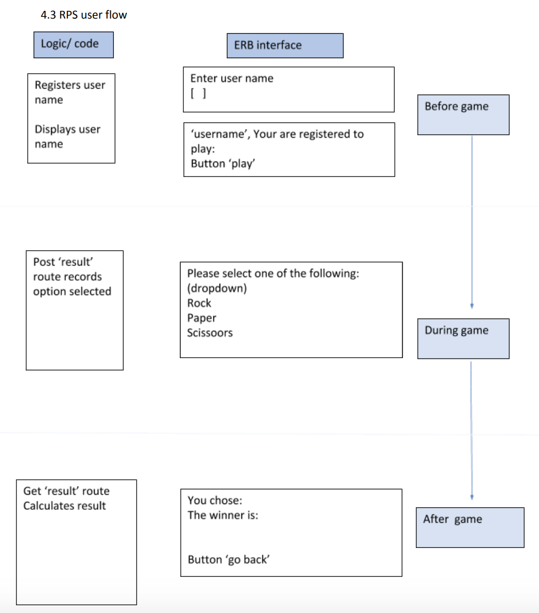

# RPS Challenge
## Objective
This is a simple sinatra app where user chooses either Rock, Paper, or Scissors, and computer chooses randomly an option and at the end a winner is declared.


TASK SUMMARY
----
The task is to provide a Rock, Paper, Scissors game for users so they can play on the web with the following user stories:

```sh
As a marketeer
So that I can see my name in lights
I would like to register my name before playing an online game

As a marketeer
So that I can enjoy myself away from the daily grind
I would like to be able to play rock/paper/scissors
```

Hints on functionality

- the marketeer should be able to enter their name before the game
- the marketeer will be presented the choices (rock, paper and scissors)
- the marketeer can choose one option
- the game will choose a random option
- a winner will be declared

## Technologies used
- ruby sinatra
- rspec
- capybara


## Setup and running
- bundle
- ruby app.rb or rackup
- run tests: rspec


## Basic Rules

- Rock beats Scissors
- Scissors beats Paper
- Paper beats Rock

APPROACH
----

## Summary
I split the user flow into 3 sections: before game, during game, and after game. App is developed test driven.



## User flow:
### Before game 
#### Tests
- user needs to see an erb with a form where they can register for the game by entering name. Hence require a get '/'
- user enters name on the form (post)
- after, user needs to see their name displayed and confirmed that they are registered (to play) on a page 

### During game
#### Tests
- user needs to do an action(e.g. press a button) to start playing the game
- user needs to see list of options to choose (e.g. paper, rock etc ) 
- user can choose the option (leads onto next phase)

### After game
#### Tests:
- user needs to see who won after choosing the option (e.g. server calculates who won in a 'box', where there is some code which determines who won, and where server randomly assigns computer a choice

#### Code:
- player class was created here to generate a new player for user and computer, and assigning an attribute of choice to it
- player1's choice was stored in params when he entered it in the dropdown option at post '/result'

calculation of who won:
- taking the choice 'which is a string' to get the index value of the options array, where it is ordered in a particular sequence for this game
- with the index value, a if statement to determine who is the winner: it gets the value inside the array according to index value and sets who wins by comparing the corresponding values of each player inside the array. The if statement returns the @winner variable which is used in the erb for display


## What i didn't do 

- shorten the calculation for winner step by server (if possible, as already the value is given, might not need index value)

- refactor the feature test where you create a new user in the tests

- 'play again button' at the end 

- further tests on Player class(if needed?)

## What i did later on (after monday)
- not fat controller (refactor it into model, add in unit tests, - commit: 'fixed game_spec temporarily')

- Made a class for the game itself where it will return a random choice 

- refactored the player class to extract RPS class where it calculates winner, and changed get '/result' page to use these new classes.


## Problems encountered (not yet solved)

- not sure how to fix the choice for computer, feature test not passing due to argument (fixed choice for computer) not passed into the game in feature test


## Things to better and further work afterwards
- write smaller feature tests (i had to amend this)


