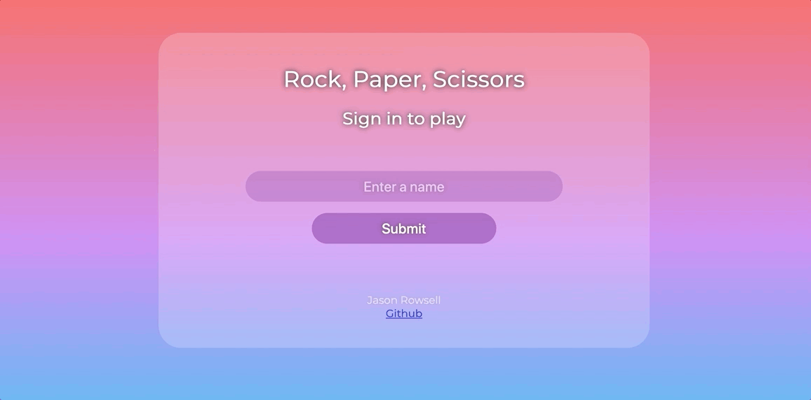

# Rock, Paper, Scissors with Web Framework

A simple game of Rock, Paper, Scissors played against an AI opponent. The web app allows the user to sign-in, choose a weapon, and play a game of Rock, Paper, Scissors.

## Play

## Screenshots




## Features

- User can sign-up using their name/username
- User can choose a weapon to play the game with
- User plays against an AI opponent featuring an animation
- User is prompted to play again and choose a different weapon
- User can track the running score during the game

## Dependencies

ruby version

- `2.6.5`
- `2.7.2`

gems

- `capybara`
- `coveralls_reborn (~> 0.20.0)`
- `puma`
- `rack`
- `rspec`
- `rubocop (= 0.79.0)`
- `shotgun`
- `simplecov`
- `simplecov`-console
- `sinatra`

## Setup

To run locally:

Clone

```
git clone git@github.com:jasonrowsell/rps-challenge
```

cd into root folder

```
cd rps-challenge
```

Install dependencies

```
bundle
```

Start the server

```
rackup
```

In your browser, head to [localhost:9292](http://localhost:9292)

## Built Using

- HTML
- CSS
- JavaScript
- jQuery
- Ruby
- Sinatra
- RSpec
